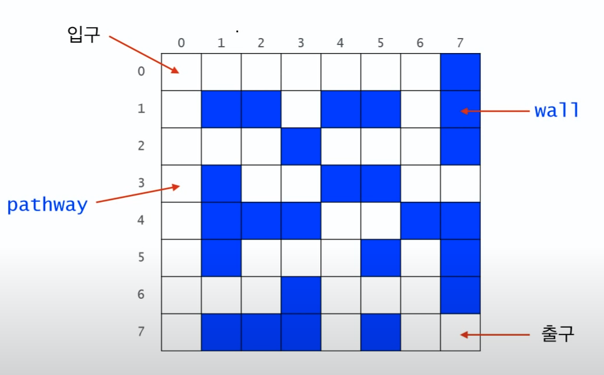

Recursive Thinking

- 절차적언어, 객체지향언어와 같은 프로그램을 작성하는 또다른 관점

- 반복문->재귀, 재귀->반복문 변환 가능

- 적어도 하나의 base case, 즉 순환되지 않고 종료되는 case가 있어야함.
- 모든 case는 결국 base case로 수렴


순환적 알고리즘 설계

- 암시적 매개변수를 명시적 매개변수로 변경

- for문은 검색할 끝은 명시돼있지만, 시작위치가 암시돼있음.

  ```java
  int search(int[] data,  int n, int target){
  	for(int i=0 ...)
      ...
  }
  ```

  

  

순차 탐색

- 반으로 쪼개서 순환하는 방식이 참신했다.


```java
int search(int [] data, int begin, int end, int target){
    if(begin > end){ // 탐색 결과가 없다면
       return -1;
    }else{
        int middle = (begin+end)/2;
        if(data[middle] == target){
            return middle;
        }
        // 재귀시작
        int index = search(data, begin, middle-1, target);
        
        if(index != -1){ // 탐색 결과가 없다면
            return index;
        }else{ // 반으로 나눈 반대편 탐색 시작
            return search(data, middle+1, end, target);
            
        }
    }
    
}


```


---


# Recursion의 응용


## 미로찾기





- 입구~출구 경로 찾는 문제

- 흰색 : 사람이 지나갈 수 있는 통로
- 파란색: 벽


### Recursive Thinking


> 현재 위치에서 출구까지 가는 경로가 있으려면
>
> 1) 현재 위치가 출구이거나 혹은
> 2) 이웃한 셀들 중 하나에서 현재 위치를 지나지 않고 출구까지 가는 경로가 있거나


- 이미 가본 위치(visited)를 표시해야, 무한루프를 막을 수 있음.


```java
public class Maze{
    private static int N=8;
    private static int [][] maze = {
      {0,0,0,0,0,0,0,0,1},
      {0,1,1,0,0,1,1,0,1},
      ... // 위 그림 참고
         
    };
    
    private static final int PATHWAY_COLOUR = 0;  // 통로
    private static final int WALL_COLOR = 1;  // 벽
    private static final int BLOCKED_COLOR = 2; // visited이며 출구까지의 경로상에 있지 않음이 밝혀진 cell
    private static final int PATH_COLOR = 3; // visited이며 아직 출구로 가는경로가 될 가능성이 있는 cell
    
    
    public static boolean findMazzPath(int x, int y){
        if(x<0 || y<0 || x>=N || y>=N){
            return false;
        }else if(maze[x][y] != PATHWAY_COLOR){  // 통로가 아닌 경우(이미 방문했거나, 벽이거나, 길이 없거나)
            return false;
        }else if(x == N-1 && y== N-1){ // 출구에 도착한 경우
            maze[x][y] = PATH_COLOR;
            return true;
        }else{
            maze[x][y] = PATH_COLOR;
            // [북,동,남,서] 순회
            if(findMazePath(x-1,y) || findMazePath(x,y+1) || findMazePath(x+1,y) || findMazePath(x,y-1)){
                return true;
            }
            maze[x][y] = BLOCKED_COLOR; // dead end
            Return false;
           
        }
    }
    
    public static void main(String[] args){
        printMaze();
        findMazePath(0,0);
        printMaze();
    }
    
}
```


- 재귀 개념이 어색하긴한대.. 적응되것지 뭐 ㅎㅎ..


