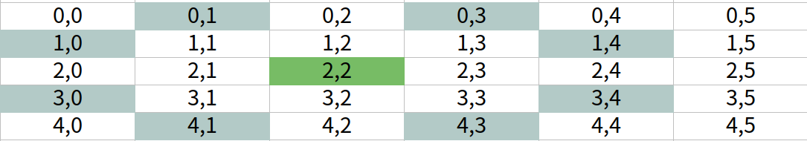

# [나이트의 이동](https://www.acmicpc.net/problem/7562)

- 로직은 비슷한 유형이라 20분만에 짰는데, Scanner 잘못 사용해서 1시간 써버림... 
   - nextInt()가 공백기준으로 읽다보니까 테스트케이스 복사할 때 조심해야할 듯



## 내 풀이

```java
import java.util.LinkedList;
import java.util.Queue;
import java.util.Scanner;

public class Main {

    private static final int[][] DIRECTION = new int[][]{{2, 1}, {2, -1}, {-2, 1}, {-2, -1}, {1, 2}, {1, -2}, {-1, 2}, {-1, -2}};
    private static Point start;
    private static Point end;
    private static int maxLength;
    private static int[][] distance;
    private static boolean[][] visited;
    private static Scanner sc = new Scanner(System.in);
    private static StringBuilder sb = new StringBuilder();

    static class Point {
        int row, col;

        public Point(int row, int col) {
            this.row = row;
            this.col = col;
        }
    }

    private static void input() {
        maxLength = sc.nextInt();

        start = null;
        end = null;

        start = new Point(sc.nextInt(), sc.nextInt());
        end = new Point(sc.nextInt(), sc.nextInt());

        visited = new boolean[maxLength][maxLength];
        distance = new int[maxLength][maxLength];

        // 거리 초기화
        for (int r = 0; r < maxLength; r++) {
            for (int c = 0; c < maxLength; c++) {
                distance[r][c] = -1;
            }
        }

        // 시작점은 0
        distance[start.row][start.col] = 0;
    }

    private static void bfs(Point start) {

        if(start.row == end.row && start.col == end.col){
            return;
        }

        Queue<Point> queue = new LinkedList<>();
        visited[start.row][start.col] = true;
        queue.add(start);

        while (!queue.isEmpty()) {
            Point point = queue.poll();

            for (int i = 0; i < DIRECTION.length; i++) {
                int newRow = point.row + DIRECTION[i][0];
                int newCol = point.col + DIRECTION[i][1];

                if (newRow < 0 || newCol < 0 || newRow > maxLength - 1 || newCol > maxLength - 1) {
                    continue;
                }
                if (visited[newRow][newCol]) {
                    continue;
                }

                queue.add(new Point(newRow, newCol));
                visited[newRow][newCol] = true;
                distance[newRow][newCol] = distance[point.row][point.col] + 1;
            }
        }

    }

    private static void print() {
        if(distance[end.row][end.col] == -1 || distance[end.row][end.col] == 0) {
            sb.append("0").append("\n");
        }else {
            sb.append(distance[end.row][end.col]).append("\n");
        }
    }

    public static void main(String[] args) {
        int testCase = sc.nextInt();

        while (testCase-- > 0) {
            input();
            bfs(start);
            print();
        }
        
        System.out.print(sb.toString().trim());
        sc.close();
    }
}
```


## 류호석님 풀이

```java
import java.io.*;
import java.lang.reflect.Array;
import java.util.*;

public class Main {
    static FastReader scan = new FastReader();
    static StringBuilder sb = new StringBuilder();

    static int N, sx, sy, ex, ey;
    static int[][] dist;
    static int[][] dir = {{-1,-2},{-2,-1},{-1,2},{-2,1},{1,-2},{2,-1},{1,2},{2,1}};
    
    static void input() {
        N = scan.nextInt();
        sx = scan.nextInt();
        sy = scan.nextInt();
        ex = scan.nextInt();
        ey = scan.nextInt();
        dist = new int[N][N];
    }

    static int bfs() {
        for (int i = 0; i < N; i++) {
            for (int j = 0; j < N; j++) {
                dist[i][j] = -1;
            }
        }
        Queue<Integer> Q = new LinkedList<>();
        dist[sx][sy] = 0;
        Q.add(sx);
        Q.add(sy);
        
        // BFS 과정 시작
        while (!Q.isEmpty()) {
            int x = Q.poll();
            int y = Q.poll();
            for (int k = 0; k < 8; k++) {
                int nx = x + dir[k][0], ny = y + dir[k][1];
                if (nx < 0 || ny < 0 || nx >= N || ny >= N) continue;  // 지도를 벗어나는 곳으로 가는가?
                if (dist[nx][ny] != -1) continue;  // 이미 방문한 적이 있는 곳인가?
                Q.add(nx);
                Q.add(ny);
                dist[nx][ny] = dist[x][y] + 1;
            }
        }
        return dist[ex][ey];
    }

    static void pro() {
        System.out.println(bfs());
    }

    public static void main(String[] args) {
        int T = scan.nextInt();
        while (T-- > 0) {
            input();
            pro();
        }
    }


    static class FastReader {
        BufferedReader br;
        StringTokenizer st;

        public FastReader() {
            br = new BufferedReader(new InputStreamReader(System.in));
        }

        public FastReader(String s) throws FileNotFoundException {
            br = new BufferedReader(new FileReader(new File(s)));
        }

        String next() {
            while (st == null || !st.hasMoreElements()) {
                try {
                    st = new StringTokenizer(br.readLine());
                } catch (IOException e) {
                    e.printStackTrace();
                }
            }
            return st.nextToken();
        }

        int nextInt() {
            return Integer.parseInt(next());
        }

        long nextLong() {
            return Long.parseLong(next());
        }

        double nextDouble() {
            return Double.parseDouble(next());
        }

        String nextLine() {
            String str = "";
            try {
                str = br.readLine();
            } catch (IOException e) {
                e.printStackTrace();
            }
            return str;
        }
    }
}
```