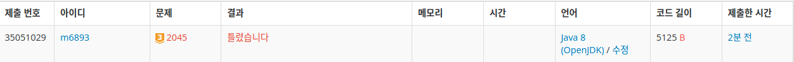

# [마방진](https://www.acmicpc.net/problem/2045)



## 왜 틀렸는지 모르겠습니다 ㅠㅠㅠ
- 대각선도 고려됐고, 테스트케이스까진 통과하는데 어떤 케이스를 생각 못한 걸까요??

```java
0 1 1
1 0 1
1 1 0
        
1 1 1 
1 1 1 
1 1 1
```
```java
1 1 0
1 0 1
0 1 1
        
1 1 1 
1 1 1 
1 1 1
```


```java
public class Main {

    static final int MAX = 3;
    static int[][] board = new int[MAX][MAX];
    static int sum = 0; // 마방진 sum
    static List<int[]> zeroList = new ArrayList<>();

    private static void input() {
        Scanner sc = new Scanner(System.in);

        for (int row = 0; row < MAX; row++) {
            // 0이 아닌 요소의 개수를 세기 위한 변수
            int count = 0;
            // sum에 넣기 전 임시 변수
            int temp = 0;

            // 값을 넣으면서, row를 합산하며 total을 구할 수 있는지 체크함
            for (int col = 0; col < MAX; col++) {
                board[row][col] = sc.nextInt();
                if (board[row][col] != 0) {
                    count++;
                    temp += board[row][col];
                } else {
                    zeroList.add(new int[]{row, col});
                }
            }

            // row에 3개 요소가 모두 존재했던 경우
            if (count == 3) {
                sum = temp;
            }
        }

        sc.close();
    }

    private static void getSum() {
        // row 순회시 합을 못구했다는 이야기
        if (sum == 0) {
            // col고정, row이동 순회
            for (int col = 0; col < MAX; col++) {
                int count = 0;
                int temp = 0;
                for (int row = 0; row < MAX; row++) {
                    if (board[row][col] != 0) {
                        count++;
                        temp += board[row][col];
                    }
                }
                // 구했다면, 더이상 순회할 필요 없음
                if (count == 3) {
                    sum = temp;
                    break;
                }
            }

            // 여전히 total이 0이라면?
            // 마방진의 대각선이 0이라는 의미
            // 대각선의 합 = (나머지 요소 전체 합/2)
            if (sum == 0) {
                int temp = 0;
                for (int row = 0; row < MAX; row++) {
                    for (int col = 0; col < MAX; col++) {
                        if (board[row][col] != 0) {
                            temp += board[row][col];
                        }
                    }
                }
                sum = temp / 2;
            }
        }
    }

    private static void fill() {

        for (int[] pos : zeroList) {
            int row = pos[0];
            int col = pos[1];

            // row 합
            if (row == 0 && board[row + 1][col] != 0 && board[row + 2][col] != 0) {
                board[row][col] = sum - (board[row + 1][col] + board[row + 2][col]);
                continue;
            } else if (row == 1 && board[row - 1][col] != 0 && board[row + 1][col] != 0) {
                board[row][col] = sum - (board[row - 1][col] + board[row + 1][col]);
                continue;
            } else if (row == 2 && board[row - 2][col] != 0 && board[row - 1][col] != 0) {
                board[row][col] = sum - (board[row - 2][col] + board[row - 1][col]);
                continue;
            }

            // col 합
            if (col == 0 && board[row][col + 1] != 0 && board[row][col + 2] != 0) {
                board[row][col] = sum - (board[row][col + 1] + board[row][col + 2]);
                continue;
            } else if (col == 1 && board[row][col - 1] != 0 && board[row][col + 1] != 0) {
                board[row][col] = sum - (board[row][col - 1] + board[row][col + 1]);
                continue;
            } else if (col == 2 && board[row][col - 2] != 0 && board[row][col - 1] != 0) {
                board[row][col] = sum - (board[row][col - 2] + board[row][col - 1]);
                continue;
            }

            // 우측 대각선 합
            if (row == 0 && col == 0 && board[row + 1][col + 1] != 0 && board[row + 2][col + 2] != 0) {
                board[row][col] = sum - (board[row + 1][col + 1] + board[row + 2][col + 2]);
                continue;
            } else if (row == 2 && col == 0 && board[row - 1][col + 1] != 0 && board[row - 2][col + 2] != 0) {
                board[row][col] = sum - (board[row - 1][col + 1] + board[row - 2][col + 2]);
                continue;
            }
            // 좌측 대각선 합
            if (row == 0 && col == 2 && board[row + 1][col - 1] != 0 && board[row + 2][col - 2] != 0) {
                board[row][col] = sum - (board[row + 1][col - 1] + board[row + 2][col - 2]);
            } else if (row == 2 && col == 2 && board[row - 1][col - 1] != 0 && board[row - 2][col - 2] != 0) {
                board[row][col] = sum - (board[row - 1][col - 1] + board[row - 2][col - 2]);
            }
        }

    }

    private static void print() {
        StringBuilder sb = new StringBuilder();

        sb.append(board[0][0] + " " + board[0][1] + " " + board[0][2])
          .append("\n")
          .append(board[1][0] + " " + board[1][1] + " " + board[1][2])
          .append("\n")
          .append(board[2][0] + " " + board[2][1] + " " + board[2][2]);

        System.out.print(sb);
    }

    public static void main(String[] args) {
        input();
        getSum();
        fill();
        print();
    }
}
```