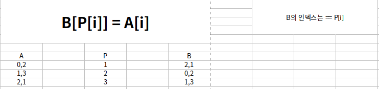
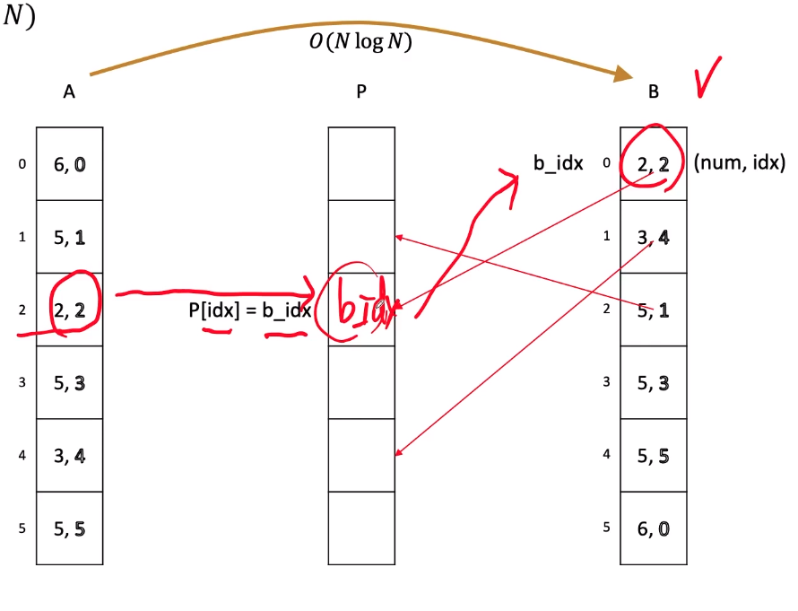

# [수열 정렬](https://www.acmicpc.net/problem/1015)



## 내 풀이
- 틀림, 중복 원소가 올 것이라는 생각을 못했음.

```java
import java.io.BufferedReader;
import java.io.IOException;
import java.io.InputStreamReader;
import java.util.Arrays;
import java.util.StringTokenizer;

public class Main {

    static final FastReader scan = new FastReader();
    static int N;
    static int[] A;
    static int[] P;
    static int[] B;

    static void input(){
        N = scan.nextInt();
        A = new int[N];

        for(int i=0; i<N; i++){
            A[i] = scan.nextInt();
        }

        P = new int[N];
        B = new int[N];
    }
    public static void main(String[] args) {
        input();

        B = A.clone();
        Arrays.sort(B);

        for(int i=0; i<N; i++){
            for(int j=0; j<N; j++) {
                if (A[i] == B[j]) {
                    P[i] = j;
                    break;
                }
            }
        }

        System.out.println(Arrays.toString(P));
    }

    static class FastReader {

        private BufferedReader br;
        private StringTokenizer st;

        public FastReader() {
            br = new BufferedReader(new InputStreamReader(System.in));
        }

        String next() {
            while (st == null || !st.hasMoreElements()) {
                try {
                    st = new StringTokenizer(br.readLine());
                } catch (IOException e) {
                    e.printStackTrace();
                }
            }
            return st.nextToken();
        }

        int nextInt() {
            return Integer.parseInt(next());
        }

        double nextDouble() {
            return Double.parseDouble(next());
        }

        String nextLine() {
            String str = "";
            try {
                str = br.readLine();
            } catch (IOException e) {
                e.printStackTrace();
            }
            return str;
        }

    }
}


```


## 모범 풀이

- tim sort : stable
- 인덱스로 바로 찾는게 신기


```java
import java.io.BufferedReader;
import java.io.IOException;
import java.io.InputStreamReader;
import java.util.Arrays;
import java.util.StringTokenizer;

public class Main {
    static final FastReader scan = new FastReader();
    static int N;
    static int[] P;
    static Elem[] B;

    static class Elem implements Comparable<Elem> {

        public int num, idx;

        @Override
        public int compareTo(Elem other) {
            // if(num != other.num){
            return num - other.num;
            // }

            // 자바의 Object Sort는 Tim sort 이므로, Stable함
            //return idx - other.idx;
        }
    }

    static void input() {
        N = scan.nextInt();
        B = new Elem[N];
        P = new int[N];

        for (int i = 0; i < N; i++) {
            B[i] = new Elem();

            B[i].num = scan.nextInt();
            B[i].idx = i;
        }

    }

    static void pro() {
        Arrays.sort(B);

        for (int bIdx = 0; bIdx < N; bIdx++) {
            P[B[bIdx].idx] = bIdx;
        }

        StringBuilder sb = new StringBuilder();
        
        for(int i=0; i<N; i++){
            sb.append(P[i]).append(" ");
        }

        System.out.println(sb);
    }

    public static void main(String[] args) {
        input();
        pro();
    }

    static class FastReader {

        private BufferedReader br;
        private StringTokenizer st;

        public FastReader() {
            br = new BufferedReader(new InputStreamReader(System.in));
        }

        String next() {
            while (st == null || !st.hasMoreElements()) {
                try {
                    st = new StringTokenizer(br.readLine());
                } catch (IOException e) {
                    e.printStackTrace();
                }
            }
            return st.nextToken();
        }

        int nextInt() {
            return Integer.parseInt(next());
        }

        double nextDouble() {
            return Double.parseDouble(next());
        }

        String nextLine() {
            String str = "";
            try {
                str = br.readLine();
            } catch (IOException e) {
                e.printStackTrace();
            }
            return str;
        }

    }
}


```