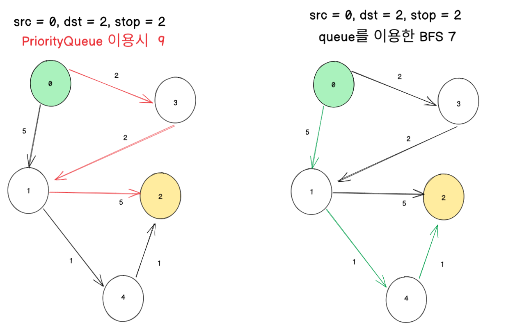

# [Cheapest Flights Within K Stops](https://leetcode.com/problems/cheapest-flights-within-k-stops/)

## 생각하지 못한 케이스
- 막연히 COST를 기준으로 PriorityQueue로 탐색하면 될줄 알았음
- 순간마다 저렴한 cost를 선택한다고 최선의 결과가 나오는 건 아니었음
- stop을 기준으로 오름차순 정렬을 했어야함.

```text
INPUT 

5
[[0,1,5],[1,2,5],[0,3,2],[3,1,2],[1,4,1],[4,2,1]]
0
2
2
```

```text
Output 

9
```

```text
Expected

7
```




## 풀이

```java
import java.util.*;

public class Solution {

    private static final int INF = Integer.MAX_VALUE;
    private static Map<Integer, List<Edge>> graph;
    private static Map<Integer, Integer> weights;

    static class Edge {
        int vertex;
        int cost;

        public Edge(int vertex, int cost) {
            this.vertex = vertex;
            this.cost = cost;
        }
    }

    static class Node {
        int vertex;
        int cost;
        int stop;

        public Node(int vertex, int cost, int stop) {
            this.vertex = vertex;
            this.cost = cost;
            this.stop = stop;
        }
    }

    public int findCheapestPrice(int n, int[][] flights, int src, int dst, int k) {
        initGraph(flights);

        return dijkstra(src, dst, k);
    }

    private int dijkstra(int src, int dst, int k) {
        Queue<Node> heap = new PriorityQueue<Node>((n1,n2)->n1.stop-n2.stop);

        int result = INF;

        heap.add(new Node(src, 0, -1));

        while (!heap.isEmpty()) {

            Node current = heap.poll();

            if (current.vertex == dst) {
                result = Math.min(result, current.cost);
            }

            if (current.stop < k) {
                List<Edge> edgeList = graph.get(current.vertex);

                for (Edge edge : edgeList) {
                    int to = edge.vertex;
                    int cost = current.cost + edge.cost;

                    if (weights.getOrDefault(to, INF) > cost) {
                        weights.put(to, cost);
                        heap.add(new Node(to, cost, current.stop + 1));
                    }
                }
            }
        }
        return result < INF ? result : -1;
    }

    private void initGraph(int[][] flights) {
        weights = new HashMap<>();

        graph = new HashMap<>();

        for (int[] flight : flights) {
            int vertex = flight[0];
            int vertex2 = flight[1];
            int cost = flight[2];

            List<Edge> edgeList = graph.getOrDefault(vertex, new ArrayList<>());
            edgeList.add(new Edge(vertex2, cost));
            graph.put(vertex, edgeList);


            List<Edge> edgeList2 = graph.getOrDefault(vertex2, new ArrayList<>());
            edgeList.add(new Edge(vertex, cost));
            graph.put(vertex2, edgeList2);
        }
    }
}


```


## 다른사람 코드

```java
class Solution {

    class Flight {
        int src;
        int dst;
        int price;

        Flight (int src, int dst, int price) {
            this.src = src;
            this.dst = dst;
            this.price = price;
        }
    }

    class Stop {
        int id, cost, count;
        Stop(int id, int cost, int count) {
            this.id = id;
            this.cost = cost;
            this.count = count;
        }
    }

    public int findCheapestPrice(int n, int[][] flights, int src, int dst, int K) {
        HashMap<Integer, ArrayList<Flight>> map = new HashMap<>();

        for (int[] flight: flights) {
            if (!map.containsKey(flight[0])) {
                map.put(flight[0], new ArrayList<Flight>());
            }
            map.get(flight[0]).add(new Flight(flight[0], flight[1], flight[2]));
        }


        Comparator<Stop> cmp = new Comparator<Stop>() {
            public int compare(Stop s1, Stop s2) {
                return s1.cost - s2.cost;
            }
        };
        PriorityQueue<Stop> q = new PriorityQueue<Stop>(cmp);

        q.offer(new Stop(src, 0, K));
        while (q != null && !q.isEmpty()) {
            Stop cur = q.poll();
            if (cur.id == dst) {
                return cur.cost;
            }

            if (cur.count >= 0) {
                List<Flight> list = map.get(cur.id);
                if (list == null) {
                    continue;
                }
                for (Flight f: list) {
                    q.offer(new Stop(f.dst, f.price + cur.cost, cur.count - 1));
                }
            }
        }

        return -1;
    }

}
```


### DFS 샘플

```java
class Solution {

    class Flight {
        int src;
        int dst;
        int price;

        Flight (int src, int dst, int price) {
            this.src = src;
            this.dst = dst;
            this.price = price;
        }
    }

    private static int cheapest;
    private static boolean routeFound;

    public int findCheapestPrice(int n, int[][] flights, int src, int dst, int K) {
        cheapest = Integer.MAX_VALUE;
        routeFound = false;
        HashMap<Integer, ArrayList<Flight>> map = new HashMap<>();

        for (int[] flight: flights) {
            if (!map.containsKey(flight[0])) {
                map.put(flight[0], new ArrayList<Flight>());
            }
            map.get(flight[0]).add(new Flight(flight[0], flight[1], flight[2]));
        }

        boolean[] visited = new boolean[n];

        dfs(map, visited, src, dst, 0, K);

        if (!routeFound) {
            return -1;
        }
        return cheapest;
    }

    private void dfs(HashMap<Integer, ArrayList<Flight>> map, boolean[] visited, int src, int dst, int cost, int k) {
        if (src == dst) {
            routeFound = true;
            cheapest = Math.min(cheapest, cost);
            return;
        }

        if (k < 0) {
            return;
        }

        ArrayList<Flight> flights = map.get(src);
        if (flights != null) {
            for (Flight flight: flights) {

                // do not visit same city twice
                if (visited[flight.dst]) {
                    continue;
                }
                // Pruning: important to reduce computation
                if (flight.price + cost > cheapest) {
                    continue;
                }
                visited[flight.dst] = true;
                dfs(map, visited, flight.dst, dst, cost + flight.price, k - 1);
                visited[flight.dst] = false;
            }
        }
    }
}
```