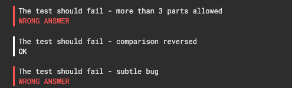

<h2 class="mod-hidden">Task description</h2>

A <code>Version<button class="sc-jSMfEi irFEjw rondo-Typography__root sc-ftvSup gavPPr rondo-Button__root ghost-variant start-icon compact icon CopyableCodeElements__InlineCopyRondoButton-sc-1mdtehs-1 crZcmy basic" type="button" data-analytics-id="task-description:copy-button">

<svg xmlns="http://www.w3.org/2000/svg" width="1em" height="1em" viewBox="0 0 24 24"><g fill="none" fill-rule="evenodd"><path d="M0 0h24v24H0z"></path><path fill="currentColor" d="M15.117 2H5.29C4.305 2 3.5 2.818 3.5 3.818v11.833a.895.895 0 0 0 1.79 0V3.818h9.827a.91.91 0 0 0 0-1.818m3.594 3.636H8.868c-.984 0-1.79.819-1.79 1.819v12.727c0 1 .806 1.818 1.79 1.818h9.843c.984 0 1.789-.818 1.789-1.818V7.455c0-1-.805-1.819-1.79-1.819m-1 14.546H9.868a1 1 0 0 1-1-1V8.455a1 1 0 0 1 1-1h7.843a1 1 0 0 1 1 1v10.727a1 1 0 0 1-1 1"></path></g></svg>

</button></code> class is defined as follows:

<pre class="CopyableCodeElements__StyledPre-sc-1mdtehs-0 dhpwcq"><code class="language-java">class Version implements Comparable&lt;Version&gt; {
    Version(String version) {
       // ...
    }

    boolean isSnapshot();
}
</code>
<button class="sc-jSMfEi irFEjw rondo-Typography__root sc-ftvSup gavPPr rondo-Button__root ghost-variant start-icon compact icon basic" type="button" data-analytics-id="task-description:copy-button">

<svg xmlns="http://www.w3.org/2000/svg" width="1em" height="1em" viewBox="0 0 24 24"><g fill="none" fill-rule="evenodd"><path d="M0 0h24v24H0z"></path><path fill="currentColor" d="M15.117 2H5.29C4.305 2 3.5 2.818 3.5 3.818v11.833a.895.895 0 0 0 1.79 0V3.818h9.827a.91.91 0 0 0 0-1.818m3.594 3.636H8.868c-.984 0-1.79.819-1.79 1.819v12.727c0 1 .806 1.818 1.79 1.818h9.843c.984 0 1.789-.818 1.789-1.818V7.455c0-1-.805-1.819-1.79-1.819m-1 14.546H9.868a1 1 0 0 1-1-1V8.455a1 1 0 0 1 1-1h7.843a1 1 0 0 1 1 1v10.727a1 1 0 0 1-1 1"></path></g></svg>

</button>
</pre>

This class follows semantic versioning rules which express a version in the format X.Y.Z, where:

<ul>
<li>X stands for <em>major</em>;</li>
<li>Y stands for <em>minor</em>;</li>
<li>Z stands for <em>patch</em>.</li>
</ul>

Your goal is to write a set of tests to check whether <code>Version<button class="sc-jSMfEi irFEjw rondo-Typography__root sc-ftvSup gavPPr rondo-Button__root ghost-variant start-icon compact icon CopyableCodeElements__InlineCopyRondoButton-sc-1mdtehs-1 crZcmy basic" type="button" data-analytics-id="task-description:copy-button">

<svg xmlns="http://www.w3.org/2000/svg" width="1em" height="1em" viewBox="0 0 24 24"><g fill="none" fill-rule="evenodd"><path d="M0 0h24v24H0z"></path><path fill="currentColor" d="M15.117 2H5.29C4.305 2 3.5 2.818 3.5 3.818v11.833a.895.895 0 0 0 1.79 0V3.818h9.827a.91.91 0 0 0 0-1.818m3.594 3.636H8.868c-.984 0-1.79.819-1.79 1.819v12.727c0 1 .806 1.818 1.79 1.818h9.843c.984 0 1.789-.818 1.789-1.818V7.455c0-1-.805-1.819-1.79-1.819m-1 14.546H9.868a1 1 0 0 1-1-1V8.455a1 1 0 0 1 1-1h7.843a1 1 0 0 1 1 1v10.727a1 1 0 0 1-1 1"></path></g></svg>

</button></code> is implemented correctly. Here are the rules:

<ol>
<li>The <code>version<button class="sc-jSMfEi irFEjw rondo-Typography__root sc-ftvSup gavPPr rondo-Button__root ghost-variant start-icon compact icon CopyableCodeElements__InlineCopyRondoButton-sc-1mdtehs-1 crZcmy basic" type="button" data-analytics-id="task-description:copy-button">

<svg xmlns="http://www.w3.org/2000/svg" width="1em" height="1em" viewBox="0 0 24 24"><g fill="none" fill-rule="evenodd"><path d="M0 0h24v24H0z"></path><path fill="currentColor" d="M15.117 2H5.29C4.305 2 3.5 2.818 3.5 3.818v11.833a.895.895 0 0 0 1.79 0V3.818h9.827a.91.91 0 0 0 0-1.818m3.594 3.636H8.868c-.984 0-1.79.819-1.79 1.819v12.727c0 1 .806 1.818 1.79 1.818h9.843c.984 0 1.789-.818 1.789-1.818V7.455c0-1-.805-1.819-1.79-1.819m-1 14.546H9.868a1 1 0 0 1-1-1V8.455a1 1 0 0 1 1-1h7.843a1 1 0 0 1 1 1v10.727a1 1 0 0 1-1 1"></path></g></svg>

</button></code> constructor argument must not be <code>null<button class="sc-jSMfEi irFEjw rondo-Typography__root sc-ftvSup gavPPr rondo-Button__root ghost-variant start-icon compact icon CopyableCodeElements__InlineCopyRondoButton-sc-1mdtehs-1 crZcmy basic" type="button" data-analytics-id="task-description:copy-button">

<svg xmlns="http://www.w3.org/2000/svg" width="1em" height="1em" viewBox="0 0 24 24"><g fill="none" fill-rule="evenodd"><path d="M0 0h24v24H0z"></path><path fill="currentColor" d="M15.117 2H5.29C4.305 2 3.5 2.818 3.5 3.818v11.833a.895.895 0 0 0 1.79 0V3.818h9.827a.91.91 0 0 0 0-1.818m3.594 3.636H8.868c-.984 0-1.79.819-1.79 1.819v12.727c0 1 .806 1.818 1.79 1.818h9.843c.984 0 1.789-.818 1.789-1.818V7.455c0-1-.805-1.819-1.79-1.819m-1 14.546H9.868a1 1 0 0 1-1-1V8.455a1 1 0 0 1 1-1h7.843a1 1 0 0 1 1 1v10.727a1 1 0 0 1-1 1"></path></g></svg>

</button></code>. If it is, an <code>IllegalArgumentException<button class="sc-jSMfEi irFEjw rondo-Typography__root sc-ftvSup gavPPr rondo-Button__root ghost-variant start-icon compact icon CopyableCodeElements__InlineCopyRondoButton-sc-1mdtehs-1 crZcmy basic" type="button" data-analytics-id="task-description:copy-button">

<svg xmlns="http://www.w3.org/2000/svg" width="1em" height="1em" viewBox="0 0 24 24"><g fill="none" fill-rule="evenodd"><path d="M0 0h24v24H0z"></path><path fill="currentColor" d="M15.117 2H5.29C4.305 2 3.5 2.818 3.5 3.818v11.833a.895.895 0 0 0 1.79 0V3.818h9.827a.91.91 0 0 0 0-1.818m3.594 3.636H8.868c-.984 0-1.79.819-1.79 1.819v12.727c0 1 .806 1.818 1.79 1.818h9.843c.984 0 1.789-.818 1.789-1.818V7.455c0-1-.805-1.819-1.79-1.819m-1 14.546H9.868a1 1 0 0 1-1-1V8.455a1 1 0 0 1 1-1h7.843a1 1 0 0 1 1 1v10.727a1 1 0 0 1-1 1"></path></g></svg>

</button></code> should be thrown with the message: <em>"'version' must not be null!"</em>.</li>
<li>The <code>version<button class="sc-jSMfEi irFEjw rondo-Typography__root sc-ftvSup gavPPr rondo-Button__root ghost-variant start-icon compact icon CopyableCodeElements__InlineCopyRondoButton-sc-1mdtehs-1 crZcmy basic" type="button" data-analytics-id="task-description:copy-button">

<svg xmlns="http://www.w3.org/2000/svg" width="1em" height="1em" viewBox="0 0 24 24"><g fill="none" fill-rule="evenodd"><path d="M0 0h24v24H0z"></path><path fill="currentColor" d="M15.117 2H5.29C4.305 2 3.5 2.818 3.5 3.818v11.833a.895.895 0 0 0 1.79 0V3.818h9.827a.91.91 0 0 0 0-1.818m3.594 3.636H8.868c-.984 0-1.79.819-1.79 1.819v12.727c0 1 .806 1.818 1.79 1.818h9.843c.984 0 1.789-.818 1.789-1.818V7.455c0-1-.805-1.819-1.79-1.819m-1 14.546H9.868a1 1 0 0 1-1-1V8.455a1 1 0 0 1 1-1h7.843a1 1 0 0 1 1 1v10.727a1 1 0 0 1-1 1"></path></g></svg>

</button></code> constructor argument must match the following regular expression: <code>\d+(\.\d+){0,2}(-SNAPSHOT)?<button class="sc-jSMfEi irFEjw rondo-Typography__root sc-ftvSup gavPPr rondo-Button__root ghost-variant start-icon compact icon CopyableCodeElements__InlineCopyRondoButton-sc-1mdtehs-1 crZcmy basic" type="button" data-analytics-id="task-description:copy-button">

<svg xmlns="http://www.w3.org/2000/svg" width="1em" height="1em" viewBox="0 0 24 24"><g fill="none" fill-rule="evenodd"><path d="M0 0h24v24H0z"></path><path fill="currentColor" d="M15.117 2H5.29C4.305 2 3.5 2.818 3.5 3.818v11.833a.895.895 0 0 0 1.79 0V3.818h9.827a.91.91 0 0 0 0-1.818m3.594 3.636H8.868c-.984 0-1.79.819-1.79 1.819v12.727c0 1 .806 1.818 1.79 1.818h9.843c.984 0 1.789-.818 1.789-1.818V7.455c0-1-.805-1.819-1.79-1.819m-1 14.546H9.868a1 1 0 0 1-1-1V8.455a1 1 0 0 1 1-1h7.843a1 1 0 0 1 1 1v10.727a1 1 0 0 1-1 1"></path></g></svg>

</button></code>. If it doesn't, an <code>IllegalArgumentException<button class="sc-jSMfEi irFEjw rondo-Typography__root sc-ftvSup gavPPr rondo-Button__root ghost-variant start-icon compact icon CopyableCodeElements__InlineCopyRondoButton-sc-1mdtehs-1 crZcmy basic" type="button" data-analytics-id="task-description:copy-button">

<svg xmlns="http://www.w3.org/2000/svg" width="1em" height="1em" viewBox="0 0 24 24"><g fill="none" fill-rule="evenodd"><path d="M0 0h24v24H0z"></path><path fill="currentColor" d="M15.117 2H5.29C4.305 2 3.5 2.818 3.5 3.818v11.833a.895.895 0 0 0 1.79 0V3.818h9.827a.91.91 0 0 0 0-1.818m3.594 3.636H8.868c-.984 0-1.79.819-1.79 1.819v12.727c0 1 .806 1.818 1.79 1.818h9.843c.984 0 1.789-.818 1.789-1.818V7.455c0-1-.805-1.819-1.79-1.819m-1 14.546H9.868a1 1 0 0 1-1-1V8.455a1 1 0 0 1 1-1h7.843a1 1 0 0 1 1 1v10.727a1 1 0 0 1-1 1"></path></g></svg>

</button></code> should be thrown with the message: <em>"'version' must match: 'major.minor.patch(-SNAPSHOT)'!"</em>.</li>
<li>The following version formats are acceptable: <code>X<button class="sc-jSMfEi irFEjw rondo-Typography__root sc-ftvSup gavPPr rondo-Button__root ghost-variant start-icon compact icon CopyableCodeElements__InlineCopyRondoButton-sc-1mdtehs-1 crZcmy basic" type="button" data-analytics-id="task-description:copy-button">

<svg xmlns="http://www.w3.org/2000/svg" width="1em" height="1em" viewBox="0 0 24 24"><g fill="none" fill-rule="evenodd"><path d="M0 0h24v24H0z"></path><path fill="currentColor" d="M15.117 2H5.29C4.305 2 3.5 2.818 3.5 3.818v11.833a.895.895 0 0 0 1.79 0V3.818h9.827a.91.91 0 0 0 0-1.818m3.594 3.636H8.868c-.984 0-1.79.819-1.79 1.819v12.727c0 1 .806 1.818 1.79 1.818h9.843c.984 0 1.789-.818 1.789-1.818V7.455c0-1-.805-1.819-1.79-1.819m-1 14.546H9.868a1 1 0 0 1-1-1V8.455a1 1 0 0 1 1-1h7.843a1 1 0 0 1 1 1v10.727a1 1 0 0 1-1 1"></path></g></svg>

</button></code>, <code>X.Y<button class="sc-jSMfEi irFEjw rondo-Typography__root sc-ftvSup gavPPr rondo-Button__root ghost-variant start-icon compact icon CopyableCodeElements__InlineCopyRondoButton-sc-1mdtehs-1 crZcmy basic" type="button" data-analytics-id="task-description:copy-button">

<svg xmlns="http://www.w3.org/2000/svg" width="1em" height="1em" viewBox="0 0 24 24"><g fill="none" fill-rule="evenodd"><path d="M0 0h24v24H0z"></path><path fill="currentColor" d="M15.117 2H5.29C4.305 2 3.5 2.818 3.5 3.818v11.833a.895.895 0 0 0 1.79 0V3.818h9.827a.91.91 0 0 0 0-1.818m3.594 3.636H8.868c-.984 0-1.79.819-1.79 1.819v12.727c0 1 .806 1.818 1.79 1.818h9.843c.984 0 1.789-.818 1.789-1.818V7.455c0-1-.805-1.819-1.79-1.819m-1 14.546H9.868a1 1 0 0 1-1-1V8.455a1 1 0 0 1 1-1h7.843a1 1 0 0 1 1 1v10.727a1 1 0 0 1-1 1"></path></g></svg>

</button></code> or <code>X.Y.Z<button class="sc-jSMfEi irFEjw rondo-Typography__root sc-ftvSup gavPPr rondo-Button__root ghost-variant start-icon compact icon CopyableCodeElements__InlineCopyRondoButton-sc-1mdtehs-1 crZcmy basic" type="button" data-analytics-id="task-description:copy-button">

<svg xmlns="http://www.w3.org/2000/svg" width="1em" height="1em" viewBox="0 0 24 24"><g fill="none" fill-rule="evenodd"><path d="M0 0h24v24H0z"></path><path fill="currentColor" d="M15.117 2H5.29C4.305 2 3.5 2.818 3.5 3.818v11.833a.895.895 0 0 0 1.79 0V3.818h9.827a.91.91 0 0 0 0-1.818m3.594 3.636H8.868c-.984 0-1.79.819-1.79 1.819v12.727c0 1 .806 1.818 1.79 1.818h9.843c.984 0 1.789-.818 1.789-1.818V7.455c0-1-.805-1.819-1.79-1.819m-1 14.546H9.868a1 1 0 0 1-1-1V8.455a1 1 0 0 1 1-1h7.843a1 1 0 0 1 1 1v10.727a1 1 0 0 1-1 1"></path></g></svg>

</button></code> - each with or without <code>-SNAPSHOT<button class="sc-jSMfEi irFEjw rondo-Typography__root sc-ftvSup gavPPr rondo-Button__root ghost-variant start-icon compact icon CopyableCodeElements__InlineCopyRondoButton-sc-1mdtehs-1 crZcmy basic" type="button" data-analytics-id="task-description:copy-button">

<svg xmlns="http://www.w3.org/2000/svg" width="1em" height="1em" viewBox="0 0 24 24"><g fill="none" fill-rule="evenodd"><path d="M0 0h24v24H0z"></path><path fill="currentColor" d="M15.117 2H5.29C4.305 2 3.5 2.818 3.5 3.818v11.833a.895.895 0 0 0 1.79 0V3.818h9.827a.91.91 0 0 0 0-1.818m3.594 3.636H8.868c-.984 0-1.79.819-1.79 1.819v12.727c0 1 .806 1.818 1.79 1.818h9.843c.984 0 1.789-.818 1.789-1.818V7.455c0-1-.805-1.819-1.79-1.819m-1 14.546H9.868a1 1 0 0 1-1-1V8.455a1 1 0 0 1 1-1h7.843a1 1 0 0 1 1 1v10.727a1 1 0 0 1-1 1"></path></g></svg>

</button></code> suffix. In <code>X<button class="sc-jSMfEi irFEjw rondo-Typography__root sc-ftvSup gavPPr rondo-Button__root ghost-variant start-icon compact icon CopyableCodeElements__InlineCopyRondoButton-sc-1mdtehs-1 crZcmy basic" type="button" data-analytics-id="task-description:copy-button">

<svg xmlns="http://www.w3.org/2000/svg" width="1em" height="1em" viewBox="0 0 24 24"><g fill="none" fill-rule="evenodd"><path d="M0 0h24v24H0z"></path><path fill="currentColor" d="M15.117 2H5.29C4.305 2 3.5 2.818 3.5 3.818v11.833a.895.895 0 0 0 1.79 0V3.818h9.827a.91.91 0 0 0 0-1.818m3.594 3.636H8.868c-.984 0-1.79.819-1.79 1.819v12.727c0 1 .806 1.818 1.79 1.818h9.843c.984 0 1.789-.818 1.789-1.818V7.455c0-1-.805-1.819-1.79-1.819m-1 14.546H9.868a1 1 0 0 1-1-1V8.455a1 1 0 0 1 1-1h7.843a1 1 0 0 1 1 1v10.727a1 1 0 0 1-1 1"></path></g></svg>

</button></code> case, <code>0<button class="sc-jSMfEi irFEjw rondo-Typography__root sc-ftvSup gavPPr rondo-Button__root ghost-variant start-icon compact icon CopyableCodeElements__InlineCopyRondoButton-sc-1mdtehs-1 crZcmy basic" type="button" data-analytics-id="task-description:copy-button">

<svg xmlns="http://www.w3.org/2000/svg" width="1em" height="1em" viewBox="0 0 24 24"><g fill="none" fill-rule="evenodd"><path d="M0 0h24v24H0z"></path><path fill="currentColor" d="M15.117 2H5.29C4.305 2 3.5 2.818 3.5 3.818v11.833a.895.895 0 0 0 1.79 0V3.818h9.827a.91.91 0 0 0 0-1.818m3.594 3.636H8.868c-.984 0-1.79.819-1.79 1.819v12.727c0 1 .806 1.818 1.79 1.818h9.843c.984 0 1.789-.818 1.789-1.818V7.455c0-1-.805-1.819-1.79-1.819m-1 14.546H9.868a1 1 0 0 1-1-1V8.455a1 1 0 0 1 1-1h7.843a1 1 0 0 1 1 1v10.727a1 1 0 0 1-1 1"></path></g></svg>

</button></code> is used for <code>Y<button class="sc-jSMfEi irFEjw rondo-Typography__root sc-ftvSup gavPPr rondo-Button__root ghost-variant start-icon compact icon CopyableCodeElements__InlineCopyRondoButton-sc-1mdtehs-1 crZcmy basic" type="button" data-analytics-id="task-description:copy-button">

<svg xmlns="http://www.w3.org/2000/svg" width="1em" height="1em" viewBox="0 0 24 24"><g fill="none" fill-rule="evenodd"><path d="M0 0h24v24H0z"></path><path fill="currentColor" d="M15.117 2H5.29C4.305 2 3.5 2.818 3.5 3.818v11.833a.895.895 0 0 0 1.79 0V3.818h9.827a.91.91 0 0 0 0-1.818m3.594 3.636H8.868c-.984 0-1.79.819-1.79 1.819v12.727c0 1 .806 1.818 1.79 1.818h9.843c.984 0 1.789-.818 1.789-1.818V7.455c0-1-.805-1.819-1.79-1.819m-1 14.546H9.868a1 1 0 0 1-1-1V8.455a1 1 0 0 1 1-1h7.843a1 1 0 0 1 1 1v10.727a1 1 0 0 1-1 1"></path></g></svg>

</button></code> and <code>Z<button class="sc-jSMfEi irFEjw rondo-Typography__root sc-ftvSup gavPPr rondo-Button__root ghost-variant start-icon compact icon CopyableCodeElements__InlineCopyRondoButton-sc-1mdtehs-1 crZcmy basic" type="button" data-analytics-id="task-description:copy-button">

<svg xmlns="http://www.w3.org/2000/svg" width="1em" height="1em" viewBox="0 0 24 24"><g fill="none" fill-rule="evenodd"><path d="M0 0h24v24H0z"></path><path fill="currentColor" d="M15.117 2H5.29C4.305 2 3.5 2.818 3.5 3.818v11.833a.895.895 0 0 0 1.79 0V3.818h9.827a.91.91 0 0 0 0-1.818m3.594 3.636H8.868c-.984 0-1.79.819-1.79 1.819v12.727c0 1 .806 1.818 1.79 1.818h9.843c.984 0 1.789-.818 1.789-1.818V7.455c0-1-.805-1.819-1.79-1.819m-1 14.546H9.868a1 1 0 0 1-1-1V8.455a1 1 0 0 1 1-1h7.843a1 1 0 0 1 1 1v10.727a1 1 0 0 1-1 1"></path></g></svg>

</button></code> values. In <code>X.Y<button class="sc-jSMfEi irFEjw rondo-Typography__root sc-ftvSup gavPPr rondo-Button__root ghost-variant start-icon compact icon CopyableCodeElements__InlineCopyRondoButton-sc-1mdtehs-1 crZcmy basic" type="button" data-analytics-id="task-description:copy-button">

<svg xmlns="http://www.w3.org/2000/svg" width="1em" height="1em" viewBox="0 0 24 24"><g fill="none" fill-rule="evenodd"><path d="M0 0h24v24H0z"></path><path fill="currentColor" d="M15.117 2H5.29C4.305 2 3.5 2.818 3.5 3.818v11.833a.895.895 0 0 0 1.79 0V3.818h9.827a.91.91 0 0 0 0-1.818m3.594 3.636H8.868c-.984 0-1.79.819-1.79 1.819v12.727c0 1 .806 1.818 1.79 1.818h9.843c.984 0 1.789-.818 1.789-1.818V7.455c0-1-.805-1.819-1.79-1.819m-1 14.546H9.868a1 1 0 0 1-1-1V8.455a1 1 0 0 1 1-1h7.843a1 1 0 0 1 1 1v10.727a1 1 0 0 1-1 1"></path></g></svg>

</button></code> case <code>0<button class="sc-jSMfEi irFEjw rondo-Typography__root sc-ftvSup gavPPr rondo-Button__root ghost-variant start-icon compact icon CopyableCodeElements__InlineCopyRondoButton-sc-1mdtehs-1 crZcmy basic" type="button" data-analytics-id="task-description:copy-button">

<svg xmlns="http://www.w3.org/2000/svg" width="1em" height="1em" viewBox="0 0 24 24"><g fill="none" fill-rule="evenodd"><path d="M0 0h24v24H0z"></path><path fill="currentColor" d="M15.117 2H5.29C4.305 2 3.5 2.818 3.5 3.818v11.833a.895.895 0 0 0 1.79 0V3.818h9.827a.91.91 0 0 0 0-1.818m3.594 3.636H8.868c-.984 0-1.79.819-1.79 1.819v12.727c0 1 .806 1.818 1.79 1.818h9.843c.984 0 1.789-.818 1.789-1.818V7.455c0-1-.805-1.819-1.79-1.819m-1 14.546H9.868a1 1 0 0 1-1-1V8.455a1 1 0 0 1 1-1h7.843a1 1 0 0 1 1 1v10.727a1 1 0 0 1-1 1"></path></g></svg>

</button></code> is used for <code>Z<button class="sc-jSMfEi irFEjw rondo-Typography__root sc-ftvSup gavPPr rondo-Button__root ghost-variant start-icon compact icon CopyableCodeElements__InlineCopyRondoButton-sc-1mdtehs-1 crZcmy basic" type="button" data-analytics-id="task-description:copy-button">

<svg xmlns="http://www.w3.org/2000/svg" width="1em" height="1em" viewBox="0 0 24 24"><g fill="none" fill-rule="evenodd"><path d="M0 0h24v24H0z"></path><path fill="currentColor" d="M15.117 2H5.29C4.305 2 3.5 2.818 3.5 3.818v11.833a.895.895 0 0 0 1.79 0V3.818h9.827a.91.91 0 0 0 0-1.818m3.594 3.636H8.868c-.984 0-1.79.819-1.79 1.819v12.727c0 1 .806 1.818 1.79 1.818h9.843c.984 0 1.789-.818 1.789-1.818V7.455c0-1-.805-1.819-1.79-1.819m-1 14.546H9.868a1 1 0 0 1-1-1V8.455a1 1 0 0 1 1-1h7.843a1 1 0 0 1 1 1v10.727a1 1 0 0 1-1 1"></path></g></svg>

</button></code> value.</li>
<li>If the <code>version<button class="sc-jSMfEi irFEjw rondo-Typography__root sc-ftvSup gavPPr rondo-Button__root ghost-variant start-icon compact icon CopyableCodeElements__InlineCopyRondoButton-sc-1mdtehs-1 crZcmy basic" type="button" data-analytics-id="task-description:copy-button">

<svg xmlns="http://www.w3.org/2000/svg" width="1em" height="1em" viewBox="0 0 24 24"><g fill="none" fill-rule="evenodd"><path d="M0 0h24v24H0z"></path><path fill="currentColor" d="M15.117 2H5.29C4.305 2 3.5 2.818 3.5 3.818v11.833a.895.895 0 0 0 1.79 0V3.818h9.827a.91.91 0 0 0 0-1.818m3.594 3.636H8.868c-.984 0-1.79.819-1.79 1.819v12.727c0 1 .806 1.818 1.79 1.818h9.843c.984 0 1.789-.818 1.789-1.818V7.455c0-1-.805-1.819-1.79-1.819m-1 14.546H9.868a1 1 0 0 1-1-1V8.455a1 1 0 0 1 1-1h7.843a1 1 0 0 1 1 1v10.727a1 1 0 0 1-1 1"></path></g></svg>

</button></code> constructor argument is correct, no exceptions should be thrown.</li>
<li><code>Version<button class="sc-jSMfEi irFEjw rondo-Typography__root sc-ftvSup gavPPr rondo-Button__root ghost-variant start-icon compact icon CopyableCodeElements__InlineCopyRondoButton-sc-1mdtehs-1 crZcmy basic" type="button" data-analytics-id="task-description:copy-button">

<svg xmlns="http://www.w3.org/2000/svg" width="1em" height="1em" viewBox="0 0 24 24"><g fill="none" fill-rule="evenodd"><path d="M0 0h24v24H0z"></path><path fill="currentColor" d="M15.117 2H5.29C4.305 2 3.5 2.818 3.5 3.818v11.833a.895.895 0 0 0 1.79 0V3.818h9.827a.91.91 0 0 0 0-1.818m3.594 3.636H8.868c-.984 0-1.79.819-1.79 1.819v12.727c0 1 .806 1.818 1.79 1.818h9.843c.984 0 1.789-.818 1.789-1.818V7.455c0-1-.805-1.819-1.79-1.819m-1 14.546H9.868a1 1 0 0 1-1-1V8.455a1 1 0 0 1 1-1h7.843a1 1 0 0 1 1 1v10.727a1 1 0 0 1-1 1"></path></g></svg>

</button></code> should correctly recognize whether or not it's defined as a snapshot by calling <code>isSnapshot()<button class="sc-jSMfEi irFEjw rondo-Typography__root sc-ftvSup gavPPr rondo-Button__root ghost-variant start-icon compact icon CopyableCodeElements__InlineCopyRondoButton-sc-1mdtehs-1 crZcmy basic" type="button" data-analytics-id="task-description:copy-button">

<svg xmlns="http://www.w3.org/2000/svg" width="1em" height="1em" viewBox="0 0 24 24"><g fill="none" fill-rule="evenodd"><path d="M0 0h24v24H0z"></path><path fill="currentColor" d="M15.117 2H5.29C4.305 2 3.5 2.818 3.5 3.818v11.833a.895.895 0 0 0 1.79 0V3.818h9.827a.91.91 0 0 0 0-1.818m3.594 3.636H8.868c-.984 0-1.79.819-1.79 1.819v12.727c0 1 .806 1.818 1.79 1.818h9.843c.984 0 1.789-.818 1.789-1.818V7.455c0-1-.805-1.819-1.79-1.819m-1 14.546H9.868a1 1 0 0 1-1-1V8.455a1 1 0 0 1 1-1h7.843a1 1 0 0 1 1 1v10.727a1 1 0 0 1-1 1"></path></g></svg>

</button></code> method. It is when the <code>version<button class="sc-jSMfEi irFEjw rondo-Typography__root sc-ftvSup gavPPr rondo-Button__root ghost-variant start-icon compact icon CopyableCodeElements__InlineCopyRondoButton-sc-1mdtehs-1 crZcmy basic" type="button" data-analytics-id="task-description:copy-button">

<svg xmlns="http://www.w3.org/2000/svg" width="1em" height="1em" viewBox="0 0 24 24"><g fill="none" fill-rule="evenodd"><path d="M0 0h24v24H0z"></path><path fill="currentColor" d="M15.117 2H5.29C4.305 2 3.5 2.818 3.5 3.818v11.833a.895.895 0 0 0 1.79 0V3.818h9.827a.91.91 0 0 0 0-1.818m3.594 3.636H8.868c-.984 0-1.79.819-1.79 1.819v12.727c0 1 .806 1.818 1.79 1.818h9.843c.984 0 1.789-.818 1.789-1.818V7.455c0-1-.805-1.819-1.79-1.819m-1 14.546H9.868a1 1 0 0 1-1-1V8.455a1 1 0 0 1 1-1h7.843a1 1 0 0 1 1 1v10.727a1 1 0 0 1-1 1"></path></g></svg>

</button></code> constructor argument ends with <code>-SNAPSHOT<button class="sc-jSMfEi irFEjw rondo-Typography__root sc-ftvSup gavPPr rondo-Button__root ghost-variant start-icon compact icon CopyableCodeElements__InlineCopyRondoButton-sc-1mdtehs-1 crZcmy basic" type="button" data-analytics-id="task-description:copy-button">

<svg xmlns="http://www.w3.org/2000/svg" width="1em" height="1em" viewBox="0 0 24 24"><g fill="none" fill-rule="evenodd"><path d="M0 0h24v24H0z"></path><path fill="currentColor" d="M15.117 2H5.29C4.305 2 3.5 2.818 3.5 3.818v11.833a.895.895 0 0 0 1.79 0V3.818h9.827a.91.91 0 0 0 0-1.818m3.594 3.636H8.868c-.984 0-1.79.819-1.79 1.819v12.727c0 1 .806 1.818 1.79 1.818h9.843c.984 0 1.789-.818 1.789-1.818V7.455c0-1-.805-1.819-1.79-1.819m-1 14.546H9.868a1 1 0 0 1-1-1V8.455a1 1 0 0 1 1-1h7.843a1 1 0 0 1 1 1v10.727a1 1 0 0 1-1 1"></path></g></svg>

</button></code>; note that this is case-sensitive.</li>
<li><code>Version<button class="sc-jSMfEi irFEjw rondo-Typography__root sc-ftvSup gavPPr rondo-Button__root ghost-variant start-icon compact icon CopyableCodeElements__InlineCopyRondoButton-sc-1mdtehs-1 crZcmy basic" type="button" data-analytics-id="task-description:copy-button">

<svg xmlns="http://www.w3.org/2000/svg" width="1em" height="1em" viewBox="0 0 24 24"><g fill="none" fill-rule="evenodd"><path d="M0 0h24v24H0z"></path><path fill="currentColor" d="M15.117 2H5.29C4.305 2 3.5 2.818 3.5 3.818v11.833a.895.895 0 0 0 1.79 0V3.818h9.827a.91.91 0 0 0 0-1.818m3.594 3.636H8.868c-.984 0-1.79.819-1.79 1.819v12.727c0 1 .806 1.818 1.79 1.818h9.843c.984 0 1.789-.818 1.789-1.818V7.455c0-1-.805-1.819-1.79-1.819m-1 14.546H9.868a1 1 0 0 1-1-1V8.455a1 1 0 0 1 1-1h7.843a1 1 0 0 1 1 1v10.727a1 1 0 0 1-1 1"></path></g></svg>

</button></code> comparison should be implemented correctly:
<ul>
<li>If a <code>null<button class="sc-jSMfEi irFEjw rondo-Typography__root sc-ftvSup gavPPr rondo-Button__root ghost-variant start-icon compact icon CopyableCodeElements__InlineCopyRondoButton-sc-1mdtehs-1 crZcmy basic" type="button" data-analytics-id="task-description:copy-button">

<svg xmlns="http://www.w3.org/2000/svg" width="1em" height="1em" viewBox="0 0 24 24"><g fill="none" fill-rule="evenodd"><path d="M0 0h24v24H0z"></path><path fill="currentColor" d="M15.117 2H5.29C4.305 2 3.5 2.818 3.5 3.818v11.833a.895.895 0 0 0 1.79 0V3.818h9.827a.91.91 0 0 0 0-1.818m3.594 3.636H8.868c-.984 0-1.79.819-1.79 1.819v12.727c0 1 .806 1.818 1.79 1.818h9.843c.984 0 1.789-.818 1.789-1.818V7.455c0-1-.805-1.819-1.79-1.819m-1 14.546H9.868a1 1 0 0 1-1-1V8.455a1 1 0 0 1 1-1h7.843a1 1 0 0 1 1 1v10.727a1 1 0 0 1-1 1"></path></g></svg>

</button></code> argument is passed to the <code>compareTo<button class="sc-jSMfEi irFEjw rondo-Typography__root sc-ftvSup gavPPr rondo-Button__root ghost-variant start-icon compact icon CopyableCodeElements__InlineCopyRondoButton-sc-1mdtehs-1 crZcmy basic" type="button" data-analytics-id="task-description:copy-button">

<svg xmlns="http://www.w3.org/2000/svg" width="1em" height="1em" viewBox="0 0 24 24"><g fill="none" fill-rule="evenodd"><path d="M0 0h24v24H0z"></path><path fill="currentColor" d="M15.117 2H5.29C4.305 2 3.5 2.818 3.5 3.818v11.833a.895.895 0 0 0 1.79 0V3.818h9.827a.91.91 0 0 0 0-1.818m3.594 3.636H8.868c-.984 0-1.79.819-1.79 1.819v12.727c0 1 .806 1.818 1.79 1.818h9.843c.984 0 1.789-.818 1.789-1.818V7.455c0-1-.805-1.819-1.79-1.819m-1 14.546H9.868a1 1 0 0 1-1-1V8.455a1 1 0 0 1 1-1h7.843a1 1 0 0 1 1 1v10.727a1 1 0 0 1-1 1"></path></g></svg>

</button></code> method, an <code>IllegalArgumentException<button class="sc-jSMfEi irFEjw rondo-Typography__root sc-ftvSup gavPPr rondo-Button__root ghost-variant start-icon compact icon CopyableCodeElements__InlineCopyRondoButton-sc-1mdtehs-1 crZcmy basic" type="button" data-analytics-id="task-description:copy-button">

<svg xmlns="http://www.w3.org/2000/svg" width="1em" height="1em" viewBox="0 0 24 24"><g fill="none" fill-rule="evenodd"><path d="M0 0h24v24H0z"></path><path fill="currentColor" d="M15.117 2H5.29C4.305 2 3.5 2.818 3.5 3.818v11.833a.895.895 0 0 0 1.79 0V3.818h9.827a.91.91 0 0 0 0-1.818m3.594 3.636H8.868c-.984 0-1.79.819-1.79 1.819v12.727c0 1 .806 1.818 1.79 1.818h9.843c.984 0 1.789-.818 1.789-1.818V7.455c0-1-.805-1.819-1.79-1.819m-1 14.546H9.868a1 1 0 0 1-1-1V8.455a1 1 0 0 1 1-1h7.843a1 1 0 0 1 1 1v10.727a1 1 0 0 1-1 1"></path></g></svg>

</button></code> should be thrown with the message: <em>"'other' must not be null!"</em>.</li>
<li>The snapshot version must always be lower than any non-snapshot version eg. <code>1.0.0-SNAPSHOT &lt; 1.0.0<button class="sc-jSMfEi irFEjw rondo-Typography__root sc-ftvSup gavPPr rondo-Button__root ghost-variant start-icon compact icon CopyableCodeElements__InlineCopyRondoButton-sc-1mdtehs-1 crZcmy basic" type="button" data-analytics-id="task-description:copy-button">

<svg xmlns="http://www.w3.org/2000/svg" width="1em" height="1em" viewBox="0 0 24 24"><g fill="none" fill-rule="evenodd"><path d="M0 0h24v24H0z"></path><path fill="currentColor" d="M15.117 2H5.29C4.305 2 3.5 2.818 3.5 3.818v11.833a.895.895 0 0 0 1.79 0V3.818h9.827a.91.91 0 0 0 0-1.818m3.594 3.636H8.868c-.984 0-1.79.819-1.79 1.819v12.727c0 1 .806 1.818 1.79 1.818h9.843c.984 0 1.789-.818 1.789-1.818V7.455c0-1-.805-1.819-1.79-1.819m-1 14.546H9.868a1 1 0 0 1-1-1V8.455a1 1 0 0 1 1-1h7.843a1 1 0 0 1 1 1v10.727a1 1 0 0 1-1 1"></path></g></svg>

</button></code>.</li>
<li>For two given versions, in terms of <code>Integer<button class="sc-jSMfEi irFEjw rondo-Typography__root sc-ftvSup gavPPr rondo-Button__root ghost-variant start-icon compact icon CopyableCodeElements__InlineCopyRondoButton-sc-1mdtehs-1 crZcmy basic" type="button" data-analytics-id="task-description:copy-button">

<svg xmlns="http://www.w3.org/2000/svg" width="1em" height="1em" viewBox="0 0 24 24"><g fill="none" fill-rule="evenodd"><path d="M0 0h24v24H0z"></path><path fill="currentColor" d="M15.117 2H5.29C4.305 2 3.5 2.818 3.5 3.818v11.833a.895.895 0 0 0 1.79 0V3.818h9.827a.91.91 0 0 0 0-1.818m3.594 3.636H8.868c-.984 0-1.79.819-1.79 1.819v12.727c0 1 .806 1.818 1.79 1.818h9.843c.984 0 1.789-.818 1.789-1.818V7.455c0-1-.805-1.819-1.79-1.819m-1 14.546H9.868a1 1 0 0 1-1-1V8.455a1 1 0 0 1 1-1h7.843a1 1 0 0 1 1 1v10.727a1 1 0 0 1-1 1"></path></g></svg>

</button></code> comparisons, the one containing <code>this.x &gt; other.x<button class="sc-jSMfEi irFEjw rondo-Typography__root sc-ftvSup gavPPr rondo-Button__root ghost-variant start-icon compact icon CopyableCodeElements__InlineCopyRondoButton-sc-1mdtehs-1 crZcmy basic" type="button" data-analytics-id="task-description:copy-button">

<svg xmlns="http://www.w3.org/2000/svg" width="1em" height="1em" viewBox="0 0 24 24"><g fill="none" fill-rule="evenodd"><path d="M0 0h24v24H0z"></path><path fill="currentColor" d="M15.117 2H5.29C4.305 2 3.5 2.818 3.5 3.818v11.833a.895.895 0 0 0 1.79 0V3.818h9.827a.91.91 0 0 0 0-1.818m3.594 3.636H8.868c-.984 0-1.79.819-1.79 1.819v12.727c0 1 .806 1.818 1.79 1.818h9.843c.984 0 1.789-.818 1.789-1.818V7.455c0-1-.805-1.819-1.79-1.819m-1 14.546H9.868a1 1 0 0 1-1-1V8.455a1 1 0 0 1 1-1h7.843a1 1 0 0 1 1 1v10.727a1 1 0 0 1-1 1"></path></g></svg>

</button></code> is bigger; or, if equal, <code>this.y &gt; other.y<button class="sc-jSMfEi irFEjw rondo-Typography__root sc-ftvSup gavPPr rondo-Button__root ghost-variant start-icon compact icon CopyableCodeElements__InlineCopyRondoButton-sc-1mdtehs-1 crZcmy basic" type="button" data-analytics-id="task-description:copy-button">

<svg xmlns="http://www.w3.org/2000/svg" width="1em" height="1em" viewBox="0 0 24 24"><g fill="none" fill-rule="evenodd"><path d="M0 0h24v24H0z"></path><path fill="currentColor" d="M15.117 2H5.29C4.305 2 3.5 2.818 3.5 3.818v11.833a.895.895 0 0 0 1.79 0V3.818h9.827a.91.91 0 0 0 0-1.818m3.594 3.636H8.868c-.984 0-1.79.819-1.79 1.819v12.727c0 1 .806 1.818 1.79 1.818h9.843c.984 0 1.789-.818 1.789-1.818V7.455c0-1-.805-1.819-1.79-1.819m-1 14.546H9.868a1 1 0 0 1-1-1V8.455a1 1 0 0 1 1-1h7.843a1 1 0 0 1 1 1v10.727a1 1 0 0 1-1 1"></path></g></svg>

</button></code>; or, if equal, <code>this.z &gt; other.z<button class="sc-jSMfEi irFEjw rondo-Typography__root sc-ftvSup gavPPr rondo-Button__root ghost-variant start-icon compact icon CopyableCodeElements__InlineCopyRondoButton-sc-1mdtehs-1 crZcmy basic" type="button" data-analytics-id="task-description:copy-button">

<svg xmlns="http://www.w3.org/2000/svg" width="1em" height="1em" viewBox="0 0 24 24"><g fill="none" fill-rule="evenodd"><path d="M0 0h24v24H0z"></path><path fill="currentColor" d="M15.117 2H5.29C4.305 2 3.5 2.818 3.5 3.818v11.833a.895.895 0 0 0 1.79 0V3.818h9.827a.91.91 0 0 0 0-1.818m3.594 3.636H8.868c-.984 0-1.79.819-1.79 1.819v12.727c0 1 .806 1.818 1.79 1.818h9.843c.984 0 1.789-.818 1.789-1.818V7.455c0-1-.805-1.819-1.79-1.819m-1 14.546H9.868a1 1 0 0 1-1-1V8.455a1 1 0 0 1 1-1h7.843a1 1 0 0 1 1 1v10.727a1 1 0 0 1-1 1"></path></g></svg>

</button></code>. If <code>x<button class="sc-jSMfEi irFEjw rondo-Typography__root sc-ftvSup gavPPr rondo-Button__root ghost-variant start-icon compact icon CopyableCodeElements__InlineCopyRondoButton-sc-1mdtehs-1 crZcmy basic" type="button" data-analytics-id="task-description:copy-button">

<svg xmlns="http://www.w3.org/2000/svg" width="1em" height="1em" viewBox="0 0 24 24"><g fill="none" fill-rule="evenodd"><path d="M0 0h24v24H0z"></path><path fill="currentColor" d="M15.117 2H5.29C4.305 2 3.5 2.818 3.5 3.818v11.833a.895.895 0 0 0 1.79 0V3.818h9.827a.91.91 0 0 0 0-1.818m3.594 3.636H8.868c-.984 0-1.79.819-1.79 1.819v12.727c0 1 .806 1.818 1.79 1.818h9.843c.984 0 1.789-.818 1.789-1.818V7.455c0-1-.805-1.819-1.79-1.819m-1 14.546H9.868a1 1 0 0 1-1-1V8.455a1 1 0 0 1 1-1h7.843a1 1 0 0 1 1 1v10.727a1 1 0 0 1-1 1"></path></g></svg>

</button></code>, <code>y<button class="sc-jSMfEi irFEjw rondo-Typography__root sc-ftvSup gavPPr rondo-Button__root ghost-variant start-icon compact icon CopyableCodeElements__InlineCopyRondoButton-sc-1mdtehs-1 crZcmy basic" type="button" data-analytics-id="task-description:copy-button">

<svg xmlns="http://www.w3.org/2000/svg" width="1em" height="1em" viewBox="0 0 24 24"><g fill="none" fill-rule="evenodd"><path d="M0 0h24v24H0z"></path><path fill="currentColor" d="M15.117 2H5.29C4.305 2 3.5 2.818 3.5 3.818v11.833a.895.895 0 0 0 1.79 0V3.818h9.827a.91.91 0 0 0 0-1.818m3.594 3.636H8.868c-.984 0-1.79.819-1.79 1.819v12.727c0 1 .806 1.818 1.79 1.818h9.843c.984 0 1.789-.818 1.789-1.818V7.455c0-1-.805-1.819-1.79-1.819m-1 14.546H9.868a1 1 0 0 1-1-1V8.455a1 1 0 0 1 1-1h7.843a1 1 0 0 1 1 1v10.727a1 1 0 0 1-1 1"></path></g></svg>

</button></code>, <code>z<button class="sc-jSMfEi irFEjw rondo-Typography__root sc-ftvSup gavPPr rondo-Button__root ghost-variant start-icon compact icon CopyableCodeElements__InlineCopyRondoButton-sc-1mdtehs-1 crZcmy basic" type="button" data-analytics-id="task-description:copy-button">

<svg xmlns="http://www.w3.org/2000/svg" width="1em" height="1em" viewBox="0 0 24 24"><g fill="none" fill-rule="evenodd"><path d="M0 0h24v24H0z"></path><path fill="currentColor" d="M15.117 2H5.29C4.305 2 3.5 2.818 3.5 3.818v11.833a.895.895 0 0 0 1.79 0V3.818h9.827a.91.91 0 0 0 0-1.818m3.594 3.636H8.868c-.984 0-1.79.819-1.79 1.819v12.727c0 1 .806 1.818 1.79 1.818h9.843c.984 0 1.789-.818 1.789-1.818V7.455c0-1-.805-1.819-1.79-1.819m-1 14.546H9.868a1 1 0 0 1-1-1V8.455a1 1 0 0 1 1-1h7.843a1 1 0 0 1 1 1v10.727a1 1 0 0 1-1 1"></path></g></svg>

</button></code> are all equal for two given versions, both versions are considered equal.</li>
</ul>
</li>
</ol>

<strong>Important</strong>:

<ul>
<li>Note that <code>-SNAPSHOT<button class="sc-jSMfEi irFEjw rondo-Typography__root sc-ftvSup gavPPr rondo-Button__root ghost-variant start-icon compact icon CopyableCodeElements__InlineCopyRondoButton-sc-1mdtehs-1 crZcmy basic" type="button" data-analytics-id="task-description:copy-button">

<svg xmlns="http://www.w3.org/2000/svg" width="1em" height="1em" viewBox="0 0 24 24"><g fill="none" fill-rule="evenodd"><path d="M0 0h24v24H0z"></path><path fill="currentColor" d="M15.117 2H5.29C4.305 2 3.5 2.818 3.5 3.818v11.833a.895.895 0 0 0 1.79 0V3.818h9.827a.91.91 0 0 0 0-1.818m3.594 3.636H8.868c-.984 0-1.79.819-1.79 1.819v12.727c0 1 .806 1.818 1.79 1.818h9.843c.984 0 1.789-.818 1.789-1.818V7.455c0-1-.805-1.819-1.79-1.819m-1 14.546H9.868a1 1 0 0 1-1-1V8.455a1 1 0 0 1 1-1h7.843a1 1 0 0 1 1 1v10.727a1 1 0 0 1-1 1"></path></g></svg>

</button></code> has to be uppercase</li>
<li>For running test cases use Java 8 and JUnit v4.12</li>
<li>assertj-core v3.11.1 is present in the classpath</li>
<li>hamcrest-core v1.3 is present in the classpath</li>
</ul>

<small>
Copyright 2009–2024 by Codility Limited.
All Rights Reserved. Unauthorized copying, publication or disclosure prohibited.
</small>

