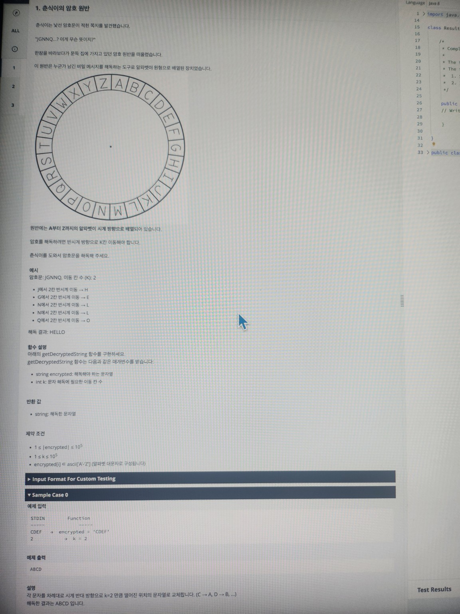

# 1. 춘식이의 암호 원반

춘식이는 낯선 암호문이 적힌 쪽지를 발견했습니다.  
“JGNNQ…? 이게 무슨 뜻이지?”  
춘식이는 암호를 바라보다가 문득 집에 가지고 있던 암호 원반을 떠올렸습니다.  
이 원반은 누군가 남긴 비밀 메시지를 해독하는 도구로, 알파벳이 원형으로 배열된 장치였습니다.

> **원반 다이어그램 설명 (참고)**
> ```
>          V   W   X   Y   Z   A   B   C   D   E
>        U                                       F
>      T                                          G
>    S                                            H
>    R                                            I
>      Q                                         J
>        P                                      K
>          O   N   M   L   K   J   I   H   G   F
> ```  
> 위와 같이 원형으로 알파벳이 배치되어 있으며, 반시계 방향으로 K칸 이동하여 해독합니다.

> **원반 설명**  
> 원반에는 A부터 Z까지의 알파벳이 시계 방향으로 배열되어 있습니다.  
> 암호를 해독하려면 반시계 방향으로 K칸 이동해야 합니다.  
> 춘식이를 도와 암호문을 해독해 주세요.

---

## 예시

- **암호문**: `IGNNO`, 이동 칸 수(K): `2`
    1. `I`에서 2칸 반시계 이동 → `H`
    2. `G`에서 2칸 반시계 이동 → `E`
    3. `N`에서 2칸 반시계 이동 → `L`
    4. `N`에서 2칸 반시계 이동 → `L`
    5. `O`에서 2칸 반시계 이동 → `O`

  **해독 결과**: `HELLO`

---

## 함수 설명

아래의 `getDecryptedString` 함수를 구현하세요.  
`getDecryptedString` 함수는 다음과 같은 매개변수를 받습니다:

- `string encrypted`: 해독해야 하는 문자열
- `int k`: 문자 해독에 필요한 이동 칸 수

### 반환 값

- `string`: 해독된 문자열

### 제약 조건

- `1 ≤ |encrypted| ≤ 10^5`
- `1 ≤ k ≤ 10^5`
- `encrypted[i] ∈ ASCII['A'..'Z']` (알파벳 대문자로 구성됩니다.)

---

## Input Format For Custom Testing

## Sample Case 0

### 예제 입력

CDEF
2

### 예제 출력

ABCD

**설명**  
각 문자를 차례대로 시계 반대 방향으로 `k = 2`만큼 떨어진 위치의 문자로 교체합니다.  
(C → A, D → B, E → C, F → D)  
해독된 결과는 `ABCD`입니다.

---

