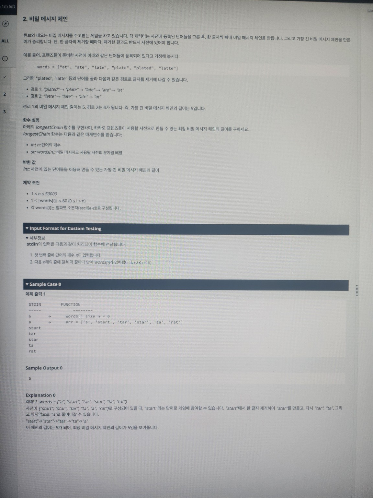

# 2. 비밀 메시지 체인

튜브와 네오는 비밀 메시지를 주고받는 게임을 하고 있습니다.  
각 캐릭터는 사전에 등록된 단어들을 고른 후, 한 글자씩 빼내 비밀 메시지 체인을 만듭니다.  
그리고 가장 긴 비밀 메시지 체인을 만든 이가 승리합니다.  
단, 한 글자씩 제거할 때마다, 제거한 결과도 반드시 사전에 있어야 합니다.

---

## 예시

프렌즈들이 준비한 사전에 아래와 같은 단어들이 등록되어 있다고 가정해 봅시다:

words = ["at", "ate", "late", "plate", "plated", "latte"]


이때 다음과 같은 경로로 글자를 제거해 나갈 수 있습니다:

- **경로 1**  
  `"plated" → "plate" → "late" → "ate" → "at"`

- **경로 2**  
  `"latte" → "late" → "ate" → "at"`

경로 1의 비밀 메시지 체인 길이는 `5`,  
경로 2의 비밀 메시지 체인 길이는 `4`입니다.  
따라서, **가장 긴 비밀 메시지 체인의 길이**는 `5`가 됩니다.

---

## 함수 설명

아래의 `longestChain` 함수를 구현하여, 카카오 프렌즈들이 사용할 사전으로 만들 수 있는 **최장 비밀 메시지 체인의 길이**를 구하세요.

```java
public static int longestChain(int n, String[] words){}
```
- 매개변수
  - int n : 단어의 개수 
  - String[] words : 비밀 메시지로 사용할 사전의 문자열 배열 
- 반환 값 
  - int : 사전에 있는 단어들을 이용해 만들 수 있는 가장 긴 비밀 메시지 체인의 길이
---

## 제약 조건

- 1 ≤ n ≤ 50 000
- 1 ≤ |words[i]| ≤ 60 (0 ≤ i < n)
- 각 words[i]는 알파벳 소문자(ascii[a-z])로 구성됩니다.


## 입력 형식 for Custom Testing

첫 번째 줄: 단어의 개수 n
다음 n개의 줄: words[i] (0 ≤ i < n)

예시

```text
6
a
start
tar
star
ta
rat
```

### Sample Case 0

```text
STDIN            FUNCTION
-----            --------------------------
6    →           words[] size n = 6
a                arr = {"a", "start", "tar", "star", "ta", "rat"}
start
tar
star
ta
rat

```

## Explanation 0

예제 0:

```text
words = {"a", "start", "tar", "star", "ta", "rat"}
```

사전에 {"start", "star", "tar", "ta", "a", "rat"}으로 구성되어 있을 때,
"start"라는 단어로 게임에 참여할 수 있습니다.

"start"에서 한 글자 제거하여 "star"를 만들고

다시 "tar" → "ta" → "a"로 줄여나갈 수 있습니다.

이 체인의 길이는 5가 되어, 최장 비밀 메시지 체인의 길이를 보여줍니다.

---

