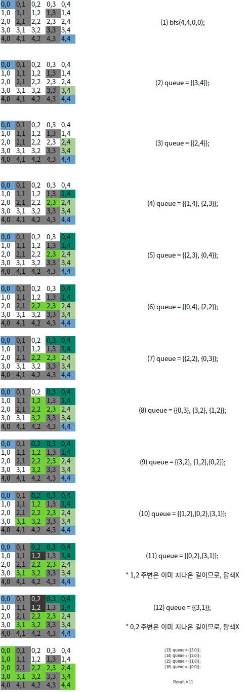

# 게임 맵 최단거리

- 최단거리 문제 코드를 외우고 있어서 무지성으로 작성해서 통과했는데, 문득 목적지까지 갈 수있는 방법이 2가지 경우인데, 이때 최단거리를 어떻게 찾지라는 생각이 들면서 혼란스러웠다.
  - 햇갈려서 그림을 그려봤는데, 확실히 이해할 수 있었다. 
    -  visited를 통해 가지치기를 하면 최단거리가 구해지는 거였다..
- bfs 시작을 목적지부터 시작한 이유는, 목적지가 벽으로 둘러 쌓여있으면 탐색의미가 없으므로 빠른 `-1`을 리턴하기 위함.

>  https://programmers.co.kr/learn/courses/30/lessons/1844



```java
public class Solution {
    private final int[][] DIRECTION = new int[][]{{1, 0}, {-1, 0}, {0, 1}, {0, -1}};
    private final int WALL = 0;
    private int MAX_ROW;
    private int MAX_COLUMN;

    class Point {
        int y;
        int x;
        int distance;

        public Point(int y, int x, int distance) {
            this.y = y;
            this.x = x;
            this.distance = distance;
        }
    }

    private int bfs(int startRow, int startColumn, int endRow, int endColumn, int[][] maps) {

        boolean[][] visited = new boolean[MAX_ROW][MAX_COLUMN];
        Queue<Point> queue = new LinkedList<>();
        visited[startRow][startColumn] = true;
        queue.add(new Point(startRow, startColumn, 1));

        while (!queue.isEmpty()) {
            Point current = queue.poll();

            if (current.y == endRow && current.x == endColumn) {
                return current.distance;
            }

            // 인접 노드 새로운 좌표 생성
            for (int i = 0; i < DIRECTION.length; i++) {

                int newRow = current.y + DIRECTION[i][0];
                int newCol = current.x + DIRECTION[i][1];

                if (newRow < 0 || newRow > MAX_ROW - 1 || newCol < 0 || newCol > MAX_COLUMN - 1) {
                    continue;
                }
                if (visited[newRow][newCol]) {
                    continue;
                }
                if (maps[newRow][newCol] == WALL) {
                    continue;
                }

                visited[newRow][newCol] = true;
                queue.add(new Point(newRow, newCol, current.distance + 1));
            }
        }
        return -1;
    }

    public int solution(int[][] maps) {

        MAX_ROW = maps.length;
        MAX_COLUMN = maps[0].length;
        
        final int START_ROW = 0;
        final int START_COL = 0;

        return bfs(MAX_ROW - 1, MAX_COLUMN - 1, START_ROW, START_COL, maps);
    }

}


```