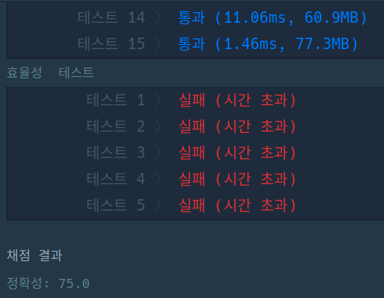

# 구명보트

- 엄청 복잡하게 풀었는데, 간결한 풀이가 있었다. 허허 :) 

> https://programmers.co.kr/learn/courses/30/lessons/42885

## 풀이(답 참고)

```java
class Solution {
   public int solution(int[] people, int limit) {

      int countOfBoat = 0;
      Arrays.sort(people);

      int left = 0;
      // 투포인터 느낌
      for (int right = people.length - 1; left <= right; right--) {

         if (people[left] + people[right] <= limit) {
            left++;
            countOfBoat++;
         } else {
            countOfBoat++;
         }
      }

      return countOfBoat;

   }
}

```

## 실패2
 - 테케는 통과하지만, 시간초과

```java
public class Solution {
    public int solution(int[] people, int limit) {
        int countOfBoat = 0;


        for (int i = 0; i < people.length; i++) {
            Map<Integer, Integer> map = new HashMap();

            if (people[i] < 0) {
                continue;
            }

            int weight = people[i];

            for (int j = i + 1; j < people.length; j++) {
                if (people[j] < 0) {
                    continue;
                }

                if (weight + people[j] <= limit) {
                    map.put(people[j], j);
                }
            }

            if (!map.isEmpty()) {

                Integer[] mapKey = map.keySet().toArray(new Integer[0]);
                Arrays.sort(mapKey, Comparator.reverseOrder());
                map.get(mapKey[0]);

                people[i] = -1;
                people[map.get(mapKey[0])] = -1;

                countOfBoat++;
            } else {
                people[i] = -1;
                countOfBoat++;
            }
        }

        return countOfBoat;
    }
}
```

## 실패1
 - 오름차순을 하면 안된다.
   - `in`: [50, 60, 70, 130 ,140, 150], 200, `out`: 3
```java
public class Solution {
    public int solution(int[] people, int limit) {
        int countOfBoat = 0;

        PriorityQueue<Integer> q = new PriorityQueue<>();

        for (Integer p : people) {
            q.add(p);
        }

        System.out.println(Arrays.toString(q.toArray()));
        while (!q.isEmpty()) {
            int temp = q.poll();

            if (!q.isEmpty() && (temp + q.peek() <= limit)) {
                q.poll();
                countOfBoat++;
            } else {
                countOfBoat++;
            }
        }

        return countOfBoat;
    }
}

```

