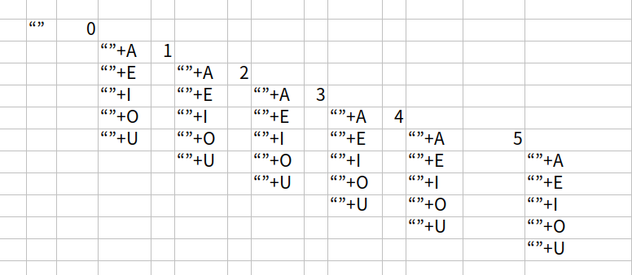

# [모음사전](https://programmers.co.kr/learn/courses/30/lessons/84512)


# 다른 사람 풀이 참고
- 재귀가 아직 어색해서, 생각을 코드로 구현하지 못했었다.
- 그와중에 딱 내가 원하던 로직이어서 참고 ㅎㅎ

```java
import java.util.*;

class Solution {
    private static List<String> dict = new ArrayList<>(); 
    private static String[] vowels = new String[]{"A", "E", "I", "O", "U"};
    
    public void dfs(String prevWord, int depth){
        if(depth >= 6){
            return;
        }
        dict.add(prevWord);
        
        for(String vowel : vowels){
            dfs(prevWord+vowel, depth+1);
        }
        
    }
    
    public int solution(String word) {
        dfs("",0);
        return dict.indexOf(word);
    }
}

```


## 다른사람 풀이2
 - 상수선언 없이 `"AEIOU".charAt(i)`로 한게 신기했다.
```java
import java.util.*;
class Solution {
    List<String> list = new ArrayList<>();
    void dfs(String str, int len) {
        if(len > 5) return;
        list.add(str);
        for(int i = 0; i < 5; i++){
            dfs(str + "AEIOU".charAt(i), len + 1);
        }
    }
    public int solution(String word) {
        dfs("", 0);
        return list.indexOf(word);
    }
}
```


