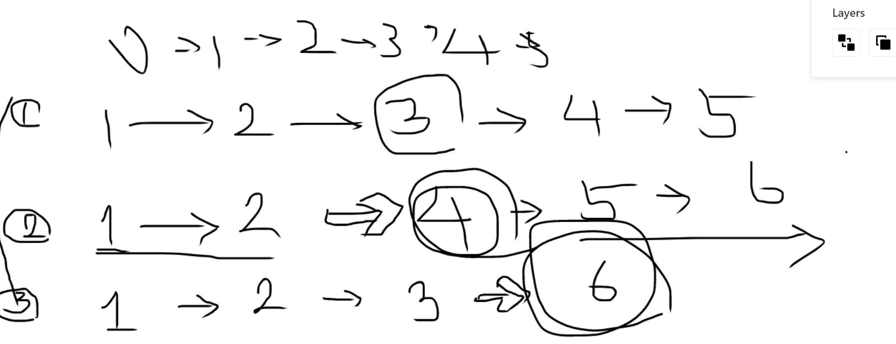

# [점프와 순간이동](https://programmers.co.kr/learn/courses/30/lessons/12980)

- 재귀가 생각이나서 풀고 싶었는데, 그마저도 구현을 하지 못했다.
    - 아직도 재귀가 어색하다니...
    - 어차피, 10억건이라 효율성에서 떨어지는 문제긴 했다.
    
- 그냥 짝수면 절반만에 갈 수 있고.. 홀수면 -하면서 다시 검사하면 되는 문제였다.
- 문제를 보고 풀이를 추출하는 힘을 좀 길러야겠다.

```java
class Solution {

    public int solution(int distance) {
        int battery = 0;

        while(distance != 0){
            if(distance % 2 == 0){
                distance /= 2;;
            }else{
                distance--;
                battery++;
            }
        }
        return battery;
    }


    @Test
    void test() {
        assertAll(
                () -> assertEquals(2, new Solution().solution(5)),
                () -> assertEquals(2, new Solution().solution(6)),
                () -> assertEquals(5, new Solution().solution(5000))
        );
    }
}


```


## 참고. 재귀로 푸는 풀이(효율성 x)

- 내가 풀고 싶었던 코드가 이 코드였다.
- https://geunzrial.tistory.com/12

```java
package programmers_2;

import java.util.ArrayList;
import java.util.Collections;

public class jump_teleport {
    ArrayList<Integer> arr = new ArrayList<>();
    
    public int solution(int n){
        int answer = 0;
        jump_tele(1,n,1);
        Collections.sort(arr);
        answer = arr.get(0);
        return answer;
    }
    
    public void jump_tele(int cur, int n,int cnt){
        if(cur == n){
            arr.add(cnt);
            return;
        }else if(cur > n){
            return;
        }
        
        jump_tele(cur*2,n,cnt);
        jump_tele(cur+1,n,cnt+1);
    }
}
```
