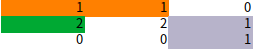

# 카카오 프렌즈 컬러링북
> https://programmers.co.kr/learn/courses/30/lessons/1829

- 탐색을 위해 노드 인근 좌표를 생성할 때, 큐에서 꺼낸 Point 좌표를 기입해야하는데, 
- DFS랑 햇갈렸는지, 초기 메소드 파라미터로 넘어온 좌표를 계속 사용하다보니 발생한 문제였다.
- 테스트가 제대로 통과하지 않아, 다른 로직상 문제가 있는줄알고 엄한곳만 많이 수정했다.
- 아직 DFS BFS가 완전히 체화되지 않아서 생긴 휴먼에러..

## 고민됐던 부분
- 영역구분
  - 처음엔 Priority Queue를 사용할까? 했는데 아래 같은 경우가 있을 수 있기때문에 포기했다.
    
  - 같은 value여도 연결되지 않았으면 다른 영역이다보니, 영역 구분을 어떻게 할지 생각하는데 시간을 좀 쓴 것 같다.
    - 각 엘리먼트마다 모두 순회하는 대신 visited를 이용해 필터해서 해결함.
```java

public class Solution {

    static final int[][] DIRECTION = new int[][]{{1, 0}, {-1, 0}, {0, 1}, {0, -1}};

    class Point {
        int y;
        int x;

        public Point(int y, int x) {
            this.y = y;
            this.x = x;
        }
    }

    public int[] solution(int m, int n, int[][] picture) {
        int numberOfArea = 0;
        int maxSizeOfOneArea = 0;

        boolean[][] visited = new boolean[m][n];

        for (int row = 0; row < m; row++) {
            for (int col = 0; col < n; col++) {
                if (picture[row][col] != 0 && !visited[row][col]) {
                    int temp = bfs(row, col, picture, visited);
                    maxSizeOfOneArea = Math.max(maxSizeOfOneArea, temp);
                    numberOfArea++;
                }
            }
        }

        int[] answer = new int[2];
        answer[0] = numberOfArea;
        answer[1] = maxSizeOfOneArea;
        return answer;
    }

    private int bfs(int row, int col, int[][] picture, boolean[][] visited) {

        int maxSizeOfOneArea = 0;
        final int MAX_ROW = picture.length;
        final int MAX_COL = picture[0].length;

        Queue<Point> queue = new LinkedList<>();

        queue.add(new Point(row, col));

        while (!queue.isEmpty()) {

            Point current = queue.poll();

            for (int i = 0; i < DIRECTION.length; i++){

                int newRow = current.y + DIRECTION[i][1];
                int newCol = current.x + DIRECTION[i][0];

                if(newRow < 0 || newRow > MAX_ROW-1 || newCol < 0 || newCol > MAX_COL-1){
                    continue;
                }
                int element = picture[current.y][current.x];
                int newElement = picture[newRow][newCol];

                if(element == newElement && !visited[newRow][newCol]){
                    visited[newRow][newCol] = true;
                    maxSizeOfOneArea++;
                    queue.add(new Point(newRow, newCol));
                }
            }
        }
        return maxSizeOfOneArea;
    }
    
}

```