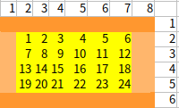

# 카펫
> https://programmers.co.kr/learn/courses/30/lessons/42842

# 접근방법

1. 갈색 펫이 테두리가 될 수 있는 노란색 카펫의 [가로, 세로] 길이를 탐색
   - `갈색 카펫 넓이` = `((노란색 카펫 가로 길이 + 2) * 2) + ((노란색 카펫 세로 길이) * 2)`
   - 
    
  - 위 공식으로 구하면, 노란색 넓이의 조합은 [6x4], [4x6]와 같이 두 가지의 쌍으로 나올 수 있음.
    - `<문제조건> 카펫의 가로 길이는 세로 길이와 같거나, 세로 길이보다 깁니다.`에 따라 가로길이의 가중치를 높이고, 모듈라 연산으로 노란색 넓이에 해당하는 길이를 구하면 됨.
2. `전체 카펫의 가로 x 세로 길이` = `(갈색 카펫 가로 + 2)  x (갈색 카펫 세로 +2) `


# 2차 시도 (성공)

- 리팩토링 하면서 얼떨결에 해결이 됐는데, 아직 어떤 테스트 케이스를 내가 고려하지 못한 건지 파악을 못했다..

```java
public class Solution {
    public int[] solution(int brown, int yellow) {
        int row;
        int coloumn;

        for (int i = 1; i <= yellow; i++) {
            if (yellow % i == 0) {
                row = yellow / i;
                coloumn = i;

                if (checkAreaOfBrown(brown, row, coloumn)) {
                    return new int[]{row + 2, coloumn + 2};
                }
            }
        }
        return null;
    }

    public boolean checkAreaOfBrown(int brown, int rowOfYellow, int coloumnOfYellow) {
        int area = ((rowOfYellow + 2) * 2) + ((coloumnOfYellow) * 2);
        return brown == area;
    }
}
```


# 첫 시도 (실패) 

```java
class Solution {
    public int[] solution(int brown, int yellow) {
        int row = yellow;
        int coloumn = 1;
 
        for(int i=2; i<yellow/2; i++){
            if(checkAreaOfBrown(brown, row, coloumn)){
                return new int[]{row+2, coloumn+2};
            }
            row = yellow/i;
            coloumn = i;
        }

        return new int[]{row+2, coloumn+2};
    }

    public boolean checkAreaOfBrown(int brown, int rowOfYellow, int coloumnOfYellow){
        int area = ((rowOfYellow+2)*2) + ((coloumnOfYellow)*2);
        return brown == area;
    }
}

```

