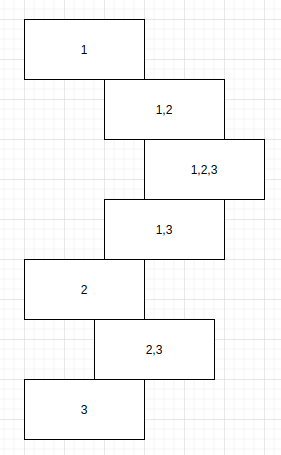

# 78. Subsets
> https://leetcode.com/problems/subsets/
- 오랜만에 다시보니 이해가 너무 안되서, 그림을 그려서 이해했다..


```java
class Solution {
    public List<List<Integer>> subsets(int[] nums) {
        List<List<Integer>> results = new ArrayList<>();
        List<Integer> elements = new ArrayList<>();
        
        dfs(0, nums, elements, results);
        
        return results;
    }
    
    public void dfs(int index, int[] nums, List<Integer> elements, List<List<Integer>> results){
        
        results.add(new ArrayList<>(elements));
        
        for(int i=index; i<nums.length; i++){
            
            elements.add(nums[i]);
            dfs(i+1, nums, elements, results);
            elements.remove(elements.size()-1);
        }
        
    }
}
```