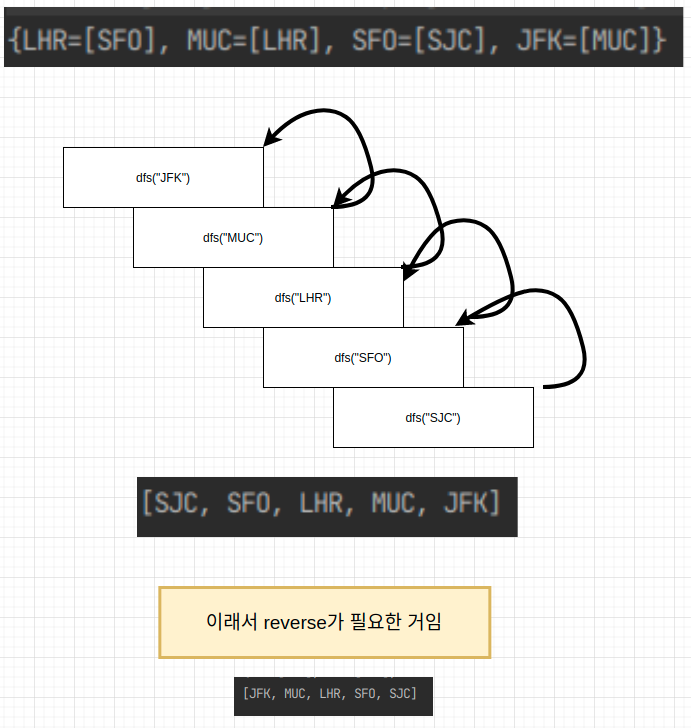

# 332. Reconstruct Itinerary

- 와 문제를 제대로 이해 못한것도 한몫했지만, 재귀가 어색해서 이해하는데 엄청 오래걸렸다...
- 중복된 일정의 경우, 어휘순으로 반복되는 점은 `PriorityQueue`로 오름차순 정렬을 하면서 넣어서 크게 문제가 되지 않았다.
- 하지만, dfs를 구현할 때 results 리스트에 추가되는 건 재귀 끝자락부터 추가되므로, 순서가 반대로 되는 것을 차마 인지하지 못했다..
- 처음엔 오름차순으로 정렬을 한번더 해야하나? 해서 시도를 해봤는데 지금까지 저장한 여행일정의 루트가 날아가서 그동안 했던 과정이 무의미하게 됐다.
- 역시, 모를땐 그림을 그리라고, 그려보니 단번에 이해할 수 있었다..(하단첨부)

> https://leetcode.com/problems/reconstruct-itinerary/

```java
public class Solution {
    public List<String> findItinerary(List<List<String>> tickets) {
        // 중복된 일정, 오름차순
        Map<String, PriorityQueue<String>> graph = new HashMap<>();
        List<String> results = new ArrayList<>();

        // 그래프 초기화
        for (List<String> ticket : tickets) {
            if (!graph.containsKey(ticket.get(0))) {
                PriorityQueue<String> queue = new PriorityQueue<>();
                queue.add(ticket.get(1));
                graph.put(ticket.get(0), queue);
            } else {
                PriorityQueue<String> queue = graph.get(ticket.get(0));
                queue.add(ticket.get(1));
                graph.replace(ticket.get(0), queue);
            }
        }
        
        dfs("JFK", graph, results);

        // 왜?
        Collections.reverse(results);

        return results;
    }

    public static void dfs(String target, Map<String, PriorityQueue<String>> graph, List<String> results) {
        // 첫 번째 값을 읽어 어휘 순으로 방문
        while (graph.containsKey(target) && !graph.get(target).isEmpty()){
            dfs(graph.get(target).poll(), graph, results);
        }
        results.add(target);
    }
}

```

