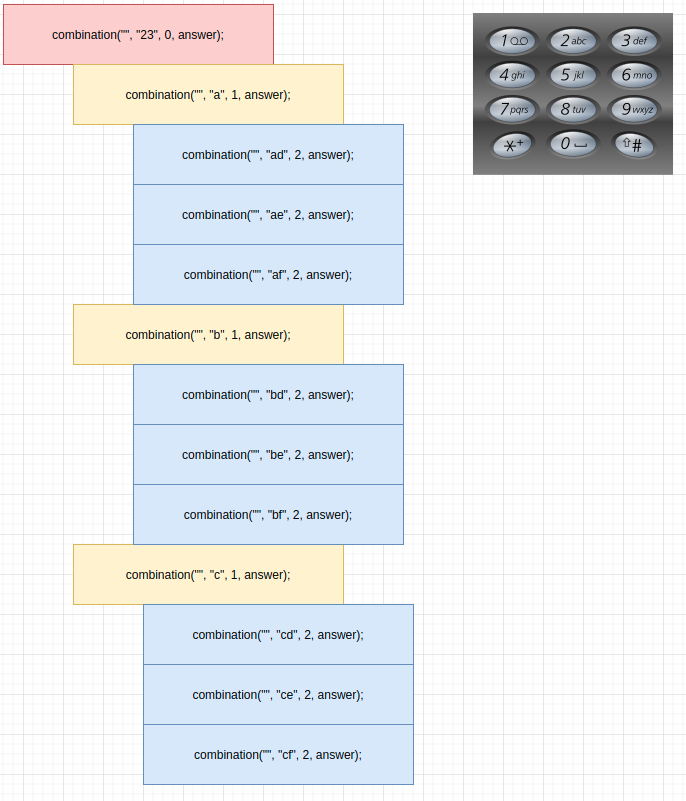

# 전화번호 문자 조합

- https://leetcode.com/problems/letter-combinations-of-a-phone-number

  

모든 조합을 탐색해야 하는 문제.

- 교재를 참고해 DFS를 통해 전체 탐색을 함.
- 처음, java의 method parmeter는 pass by value라는 것을 까먹고 메소드가 재귀 될때 offset의 변화가 이해가 가지 않았다.
  - 그림을 그려보니, 그제야 이해할 수 있었다. ㅎㅎㅎ (멍청한 나)



```java
public class 전화번호문자조합 {
    private static final String[] marks = new String[]{"","","abc","def","ghi","jkl","mno","pqrs","tuv","wxyz"};
    private static List<String> answers;

    public List<String> letterCombinations(String digits) {

        answers = new ArrayList<>();

        if(digits.length() == 0){
            return answers;
        }

        combination("", digits, 0);

        return answers;
    }


    public void combination(String prefix, String digits, int offset){

        if(offset == digits.length()){
            answers.add(prefix);
            return;
        }

        String letter = marks[digits.charAt(offset)-'0'];

        for(int i=0; i<letter.length(); i++){
            combination(prefix+letter.charAt(i),digits,offset+1);
        }

    }

}
```


