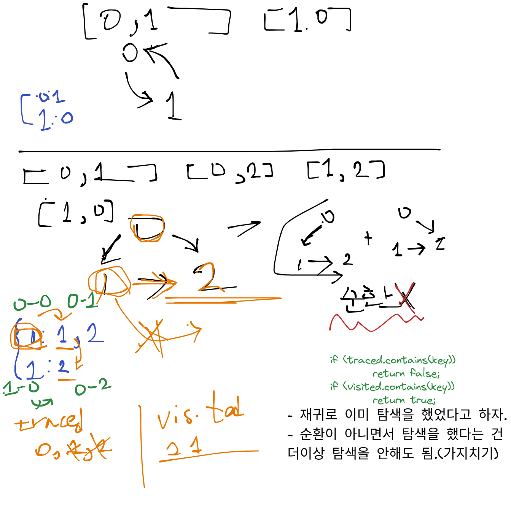

# 207. Course Schedule

- 어제는 분명 이해가 안갔는데, 다시 보니 이해가 된다. 혹시 나중에 또 기억 못할까봐 그림 끄적여둠
- 재귀.. 언제쯤 익숙해질까 ㅎㅎ

> https://leetcode.com/problems/course-schedule/

```text
입력

100,
[[1,0],[2,0],[2,1],[3,1],[3,2],[4,2],[4,3],[5,3],[5,4],[6,4],[6,5],[7,5],[7,6],[8,6],[8,7],[9,7],[9,8],[10,8],[10,9],[11,9],[11,10],[12,10],[12,11],[13,11],[13,12],[14,12],[14,13],[15,13],[15,14],[16,14],[16,15],[17,15],[17,16],[18,16],[18,17],[19,17],[19,18],[20,18],[20,19],[21,19],[21,20],[22,20],[22,21],[23,21],[23,22],[24,22],[24,23],[25,23],[25,24],[26,24],[26,25],[27,25],[27,26],[28,26],[28,27],[29,27],[29,28],[30,28],[30,29],[31,29],[31,30],[32,30],[32,31],[33,31],[33,32],[34,32],[34,33],[35,33],[35,34],[36,34],[36,35],[37,35],[37,36],[38,36],[38,37],[39,37],[39,38],[40,38],[40,39],[41,39],[41,40],[42,40],[42,41],[43,41],[43,42],[44,42],[44,43],[45,43],[45,44],[46,44],[46,45],[47,45],[47,46],[48,46],[48,47],[49,47],[49,48],[50,48],[50,49],[51,49],[51,50],[52,50],[52,51],[53,51],[53,52],[54,52],[54,53],[55,53],[55,54],[56,54],[56,55],[57,55],[57,56],[58,56],[58,57],[59,57],[59,58],[60,58],[60,59],[61,59],[61,60],[62,60],[62,61],[63,61],[63,62],[64,62],[64,63],[65,63],[65,64],[66,64],[66,65],[67,65],[67,66],[68,66],[68,67],[69,67],[69,68],[70,68],[70,69],[71,69],[71,70],[72,70],[72,71],[73,71],[73,72],[74,72],[74,73],[75,73],[75,74],[76,74],[76,75],[77,75],[77,76],[78,76],[78,77],[79,77],[79,78],[80,78],[80,79],[81,79],[81,80],[82,80],[82,81],[83,81],[83,82],[84,82],[84,83],[85,83],[85,84],[86,84],[86,85],[87,85],[87,86],[88,86],[88,87],[89,87],[89,88],[90,88],[90,89],[91,89],[91,90],[92,90],[92,91],[93,91],[93,92],[94,92],[94,93],[95,93],[95,94],[96,94],[96,95],[97,95],[97,96],[98,96],[98,97],[99,97]]

```


```java
public class Solution {
    public boolean canFinish(int numCourses, int[][] prerequisites) {
        Map<Integer, Deque<Integer>> graph = new HashMap<>();
        // 그래프의 순환 파악을 위해 set 정의: 노드 중복 감지용
        Set<Integer> traced = new HashSet<>();

        Set<Integer> visited = new HashSet<>();

        // 그래프 초기화
        for (int[] pre : prerequisites) {
            if (!graph.containsKey(pre[0])) {
                Deque<Integer> queue = new ArrayDeque<>();
                queue.add(pre[1]);
                graph.put(pre[0], queue);
            } else {
                Deque<Integer> queue = graph.get(pre[0]);
                queue.add(pre[1]);
                graph.replace(pre[0], queue);
            }
        }

        // 순환 구조 판별
        for (Integer key : graph.keySet()) {
            if (!dfs(key, graph, traced, visited)) {
                return false;
            }
        }
        return true;
    }

    private boolean dfs(Integer key, Map<Integer, Deque<Integer>> graph, Set<Integer> traced, Set<Integer> visited) {
        // 순환 구조이면 False
        if (traced.contains(key)) {
            return false;
        }
        if (visited.contains(key)) {
            return true;
        }

        traced.add(key);

        if (!graph.isEmpty() && graph.containsKey(key)) {
            for (Integer value : graph.get(key)) {
                if (!dfs(value, graph, traced, visited)) {
                    return false;
                }
            }
        }

        // 탐색 종료 후 순환 노드 삭제
        // 형제노드가 방문한 노드까지 남게 되어, 순환으로 잘못할 판단 가능성을 없애기 위해
        traced.remove(key);

        // 탐색 종료 후 방문 노드 추가
        visited.add(key);

        return true;
    }

    public static void main(String[] args) {
        System.out.println(new Solution().canFinish(2, new int[][]{{1,0},{2,0},{2,1},{3,1},{3,2}}));
    }
}

```

